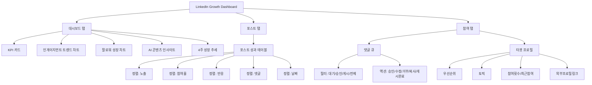
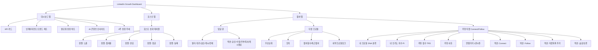
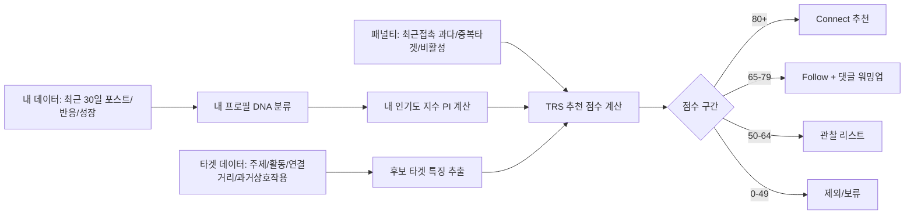

# LinkedIn Growth Dashboard Mermaid Sitemap

아래는 현재 구현(As-Is), 요구사항 반영(To-Be), 그리고 추천 점수 계산 흐름입니다.

---

## 1) As-Is Sitemap



---

## 2) To-Be Sitemap (네트워크 추천 기능 포함)



---

## 3) 추천 점수 계산 흐름



### TRS 공식

```text
TRS = 0.30*TopicFit + 0.25*ResponseProbability + 0.20*PopularityFit + 0.15*NetworkDistanceFit + 0.10*RecentActivity - Penalty
```
