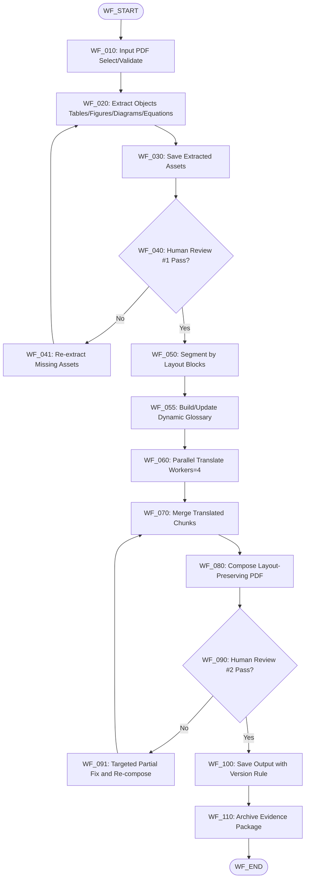
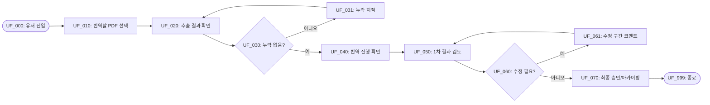

# PRD v2 — 영문 논문 PDF → 한국어 논문 PDF 번역/아카이빙 에이전트

## 0) Document Meta

| 항목 | 내용 |
|---|---|
| 문서 목적 | 구현 전 요구사항/흐름/검증 기준 확정 |
| 대상 독자 | PM, 개발, QA, 최종사용자 |
| 문서 상태 | Draft v2.0 (구체화 완료) |
| 현재 단계 | 기획 완료, 구현 미착수 |

---

## 1) Problem & Goal

### 1.1 문제 정의
- 영문 논문을 한국어로 아카이빙할 때, 수작업 번역/편집으로 시간이 오래 걸리고 레이아웃 품질이 불안정함.
- 표/다이어그램/수식 누락 또는 훼손이 발생해 재작업 비용이 큼.

### 1.2 목표 (Goals)
- G-001: 원문 레이아웃을 최대한 유지한 한국어 번역 PDF 생성
- G-002: 표/다이어그램/그림/수식 무결성 유지
- G-003: 2단계 Human Review로 정확도 중심 품질 확보
- G-004: 최종 산출물과 검수 이력을 아카이빙 가능하게 저장

### 1.3 비목표 (Non-Goals)
- NG-001: 논문 내용 요약/재집필 자동화
- NG-002: 저널 제출 포맷 자동 최적화

---

## 2) Users & Scenarios

### 2.1 핵심 사용자
- U-001: 아카이빙 담당자 (실행/운영)
- U-002: 1인 최종사용자 (최종 검수/승인 책임자)

### 2.2 핵심 시나리오
1. 사용자가 폴더의 대상 PDF를 지정한다.
2. 시스템이 표/다이어그램/그림/수식을 추출하고 중간 결과를 생성한다.
3. 최종사용자가 추출 누락을 검수한다 (Review #1).
4. 시스템이 레이아웃 블록 단위로 병렬 번역 후 취합한다.
5. 시스템이 원문 레이아웃을 기준으로 한국어 PDF를 재합성한다.
6. 최종사용자가 결과를 검수하고 부분 수정 지시를 반영한다 (Review #2).
7. 최종본과 증빙 자료를 아카이빙한다.

---

## 3) Scope / Constraints / Assumptions

### 3.1 In Scope
- PDF 지정/검증
- 이미지/표/다이어그램/수식 추출
- 레이아웃 보존 번역/취합
- Human Review #1, #2
- 부분 수정 루프
- 버전 관리 및 아카이빙

### 3.2 Out of Scope
- 논문 요약/해설 작성
- 출판사별 제출 포맷 최적화

### 3.3 제약조건
- 정확도 우선 (속도보다 품질)
- 최종 승인 책임자는 1인 최종사용자
- 복합 수식 포함 수식은 원문 이미지 유지 (재렌더링 금지)
- 병렬 번역 기본 워커 수 4 (v1 고정)

### 3.4 가정
- 입력 PDF가 텍스트 추출 가능하거나 OCR 가능한 품질
- 출력 저장소 접근 권한/용량 확보

---

## 4) Functional Requirements (FR)

| ID | 요구사항 | 우선순위 |
|---|---|---|
| FR-001 | 대상 PDF를 지정하고 유효성 검증할 수 있어야 한다 | Must |
| FR-002 | 표/다이어그램/그림/수식을 객체 단위로 추출/저장해야 한다 | Must |
| FR-003 | Human Review #1(추출 누락 검수) 체크포인트를 제공해야 한다 | Must |
| FR-004 | 문서를 레이아웃 블록(text box) 단위로 분할해야 한다 | Must |
| FR-005 | 병렬 번역 워커를 기본 4로 실행해야 한다 | Must |
| FR-006 | 번역 중 동적 glossary를 생성/누적/강제 적용해야 한다 | Must |
| FR-007 | glossary 자동 채택 임계치 0.90을 적용해야 한다 | Must |
| FR-008 | 임계치 미만 용어는 Review #2 검토 대기로 분류해야 한다 | Must |
| FR-009 | 수식은 원문 이미지 유지 정책을 강제해야 한다 | Must |
| FR-010 | 다이어그램 내부 텍스트는 중요 요소만 선택 번역해야 한다 | Must |
| FR-011 | 표는 하이브리드(재구성 우선, 저신뢰 시 이미지 폴백)로 처리해야 한다 | Must |
| FR-012 | 번역 결과를 원문 레이아웃 기준으로 재합성해야 한다 | Must |
| FR-013 | Human Review #2 및 부분 수정 루프를 지원해야 한다 | Must |
| FR-014 | 파일명 규칙 `{원문명}_ko_v{n}.pdf`를 준수해야 한다 | Must |
| FR-015 | 수정 반영 시 overwrite 없이 v+1 신규 파일을 생성해야 한다 | Must |
| FR-016 | 아카이빙 패키지(PDF+자산+로그+리뷰이력)를 저장해야 한다 | Must |

---

## 5) Non-Functional Requirements (NFR)

| ID | 카테고리 | 요구사항 | 목표값 |
|---|---|---|---|
| NFR-001 | Quality | 번역 정확도 | Human Review 승인율 95%+ |
| NFR-002 | Reliability | 실패 복구 | 실패 청크만 최대 3회 재시도 |
| NFR-003 | Consistency | 용어 일관성 | glossary 충돌율 기준 이하 |
| NFR-004 | Observability | 추적성 | 단계별 로그/상태 저장 |
| NFR-005 | Governance | 승인 책임 | 1인 최종사용자 승인 로그 필수 |

---

## 6) Mermaid Workflow (시스템 관점)

---

## 7) Mermaid Userflow (유저 관점)

---

## 8) Data / State / Interface

### 8.1 핵심 데이터 모델
- `TaskRun(run_id, input_pdf, status, started_at, ended_at)`
- `Asset(asset_id, page, bbox, type, file_path)`
- `Segment(segment_id, page_range, source_text, translated_text)`
- `Glossary(term, candidate, score, status[accepted|pending])`
- `ReviewNote(review_id, phase, target_ref, comment, resolved)`

### 8.2 상태 전이
- `NEW -> EXTRACTING -> REVIEW1 -> TRANSLATING -> COMPOSING -> REVIEW2 -> ARCHIVED`
- 리뷰 실패 시 `REVIEW1/REVIEW2 -> REVISION -> COMPOSING`

---

## 9) API / 기술 스택 확정안 (v1)

### 9.1 확정안 (Primary)
- **번역/용어집/품질 보조: Google Gemini API**
  - SDK: `google-genai`
  - 기본 모델: `gemini-2.0-flash`
  - 역할:
    - 레이아웃 블록 단위 영→한 번역
    - 동적 glossary 후보 생성 및 점수화
    - 중요 요소(다이어그램 텍스트) 선택 번역 보조
- **OCR(스캔 PDF fallback): Google Cloud Vision API**
  - 사용 조건: 로컬 추출 품질이 기준 미만일 때만 호출
- **레이아웃/객체 추출 + PDF 합성: 로컬 라이브러리**
  - 추출: `PyMuPDF`, `pdfplumber`
  - 합성: `PyMuPDF` (필요 시 `reportlab` 보조)

### 9.2 백업안 (Contingency)
- **번역 API 백업:** Gemini 장애/쿼터 이슈 시
  - Option B1: 동일 파이프라인에서 상위 Gemini 모델로 임시 전환
  - Option B2: DeepL API로 번역만 대체(용어집 로직은 내부 유지)
- **OCR API 백업:** Vision API 장애 시
  - Option O1: Azure Document Intelligence
  - Option O2: Tesseract(로컬, 정확도 저하 감수)

### 9.3 결정 근거
- 정확도 우선 + 구현 복잡도 최소화 관점에서 **Primary API를 1개 축(Gemini)으로 단순화**
- OCR은 상시 API 호출 대신 **fallback 호출**로 비용 절감
- 레이아웃 추출/합성은 로컬 처리로 재현성과 디버깅 용이성 확보

### 9.4 운영 기준 (초기)
- glossary 자동 채택 임계치: `0.90`
- 병렬 번역 워커: `4` 고정(v1)
- 수식 정책: 원문 이미지 유지(재렌더링 금지)
- 파일 버전 정책: `{원문명}_ko_v{n}.pdf`, overwrite 금지

---

## 10) Error Handling & Recovery

| 에러 | 감지 | 처리 |
|---|---|---|
| ERR-001 추출 실패 | 페이지 단위 예외 | 페이지 단위 최대 3회 재시도 |
| ERR-002 번역 청크 실패 | 워커 오류/타임아웃 | 실패 청크만 재시도 후 에스컬레이션 |
| ERR-003 레이아웃 합성 실패 | 렌더 검증 실패 | 해당 페이지 재합성 |
| ERR-004 리뷰 미통과 | Human Review 코멘트 | 부분 수정 루프 재실행 |

---

## 11) Acceptance Criteria (AC)

| ID | 기준 |
|---|---|
| AC-001 | 수식 재렌더링 위반 0건 |
| AC-002 | 추출 누락 0건(Review #1 통과) |
| AC-003 | 다이어그램 중요 요소 번역 체크리스트 100% |
| AC-004 | 표 하이브리드 정책 준수 |
| AC-005 | 번역 정확도 승인율 95%+ |
| AC-006 | 부분 수정 후 미해결 코멘트 0건 |
| AC-007 | 파일명/버전 규칙 100% 준수 |
| AC-008 | 아카이빙 패키지 4종(PDF+자산+로그+리뷰이력) 누락 0건 |

---

## 12) Test Plan (TC)

| TC ID | 테스트 목적 |
|---|---|
| TC-001 | 입력 PDF 유효성 검증 |
| TC-002 | 객체 추출 누락 검증 |
| TC-003 | 수식 이미지 유지 검증 |
| TC-004 | 다이어그램 선택 번역 검증 |
| TC-005 | 표 하이브리드 폴백 검증 |
| TC-006 | glossary 임계치(0.90) 동작 검증 |
| TC-007 | 병렬 워커 4 실행/취합 검증 |
| TC-008 | 부분 수정 루프 검증 |
| TC-009 | 파일명/버전 규칙 검증 |
| TC-010 | 아카이브 패키지 완전성 검증 |

---

## 13) Traceability Matrix (요약)

| Req ID | Workflow | Userflow | AC | TC |
|---|---|---|---|---|
| FR-009(수식 유지) | WF_060, WF_080 | UF_050 | AC-001 | TC-003 |
| FR-010(다이어그램) | WF_060 | UF_050 | AC-003 | TC-004 |
| FR-011(표 하이브리드) | WF_020, WF_080 | UF_050 | AC-004 | TC-005 |
| FR-006/007(glossary) | WF_055, WF_060 | UF_040 | AC-005 | TC-006 |
| FR-014/015(버전) | WF_100 | UF_070 | AC-007 | TC-009 |
| FR-016(아카이빙) | WF_110 | UF_070 | AC-008 | TC-010 |

---

## 14) 개발 현황 (현재 시점)

- 구현 코드: **미착수**
- 상태: PRD 구체화 완료, 구현/테스트 전
- 다음 단계:
  1. 프로젝트 초기 구조 생성 (`src/`, `tests/`, `output/`)
  2. PDF 추출/분할 모듈 구현
  3. Translation API 연동
  4. Compose + Review 루프 구현
  5. Validation 증빙 채우기

---

## 15) Go / No-Go Gate

- [x] PRD v2 필수 섹션 작성
- [x] Workflow/Userflow 정의
- [x] AC/TC 정의
- [x] API 전략 초안 확정
- [ ] 실행 증빙(E-01~E-13) 완료
- [ ] 최종사용자 승인 로그 완료

**현재 결론: NO-GO (구현 착수 전 단계)**
