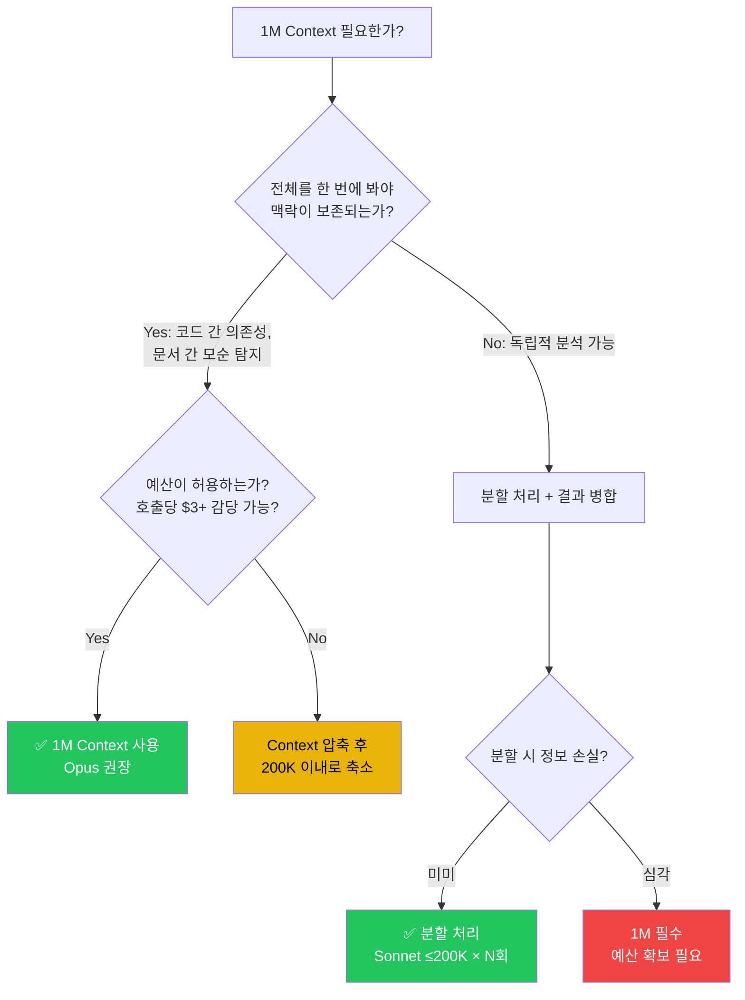

# 7.4 1M Context 비용 전략: 큰 창은 큰 청구서를 부른다

## 1M Context 시대의 패러다임 전환

Claude Opus 4.6과 Sonnet 4.6이 1M token context window를 제공하면서, PM의 비용 계산 방식이 근본적으로 달라졌다.

**이전**: "싸게 많이 호출" — 작은 context로 수백 번 호출, 건당 $0.01
**현재**: "비싸게 한 번 호출" — 거대한 context로 한 번 호출, 건당 $5~$30

1M tokens는 약 75만 단어, 약 3,000개 소스 파일에 해당한다. **전체 코드베이스**, **경쟁사 보고서 50건**, **6개월치 사용자 인터뷰 전문**을 한 번에 넣을 수 있다. 하지만 그렇게 해야 하는가?

**이 장의 핵심 질문**: "1M context를 쓸 수 있다"와 "1M context를 써야 한다"는 완전히 다른 문제다.

---

## 비용 시뮬레이션: 3가지 컨텍스트 규모

### 시뮬레이션 1: 기업 PRD 분석 (10K tokens)

**시나리오**: PM이 PRD 문서 1건(약 10K tokens)의 완결성, 모순점, 누락 항목을 분석한다.

| 모델 | Input 비용 | Output 비용 (2K tokens) | **총 비용** | 품질 |
|------|-----------|------------------------|-------------|------|
| Haiku 4.5 | $0.010 | $0.010 | **$0.020** | 충분 (구조적 검토) |
| Sonnet 4.6 | $0.030 | $0.030 | **$0.060** | 우수 (논리적 모순 탐지) |
| Opus 4.6 | $0.050 | $0.050 | **$0.100** | 과잉 (이 규모에선 불필요) |
| Gemini Flash | $0.003 | $0.005 | **$0.008** | 기본 (빠른 초벌) |

**결론**: 10K context에서는 모델 간 비용 차이가 미미($0.01~$0.10). **품질 기준으로만 선택**하면 된다.

---

### 시뮬레이션 2: 경쟁사 종합 분석 (200K tokens)

**시나리오**: 경쟁사 5곳의 블로그, 릴리즈 노트, 뉴스, 채용공고를 한 번에 분석한다. 총 200K tokens.

| 모델 | Input 비용 | Output 비용 (10K tokens) | **총 비용** | 비고 |
|------|-----------|------------------------|-------------|------|
| Sonnet 4.6 | $0.60 | $0.15 | **$0.75** | ≤200K → 표준 가격 |
| Sonnet 4.6 (201K) | $1.21 | $0.23 | **$1.44** | >200K → 2x 가격! |
| Opus 4.6 | $1.00 | $0.25 | **$1.25** | 단일 가격 |
| Gemini 2.5 Pro | $0.25 | $0.10 | **$0.35** | 최저가 (≤200K) |

**핵심 발견**: **200K 경계가 비용 분기점**이다.
- 200K 정확히 → Sonnet $0.75
- 201K (1K 초과) → Sonnet $1.44 (93% 증가!)
- 이 경우 Opus($1.25)가 Sonnet($1.44)보다 **저렴하면서 고품질**

---

### 시뮬레이션 3: 전체 코드리뷰 (600K tokens)

**시나리오**: 인수 대상 스타트업의 코드베이스 전체를 한 번에 리뷰한다. 약 600K tokens.

| 모델 | Input 비용 | Output 비용 (50K tokens) | **총 비용** | MRCR@1M |
|------|-----------|------------------------|-------------|---------|
| Opus 4.6 | $3.00 | $1.25 | **$4.25** | 76% |
| Sonnet 4.6 | $3.60 | $1.13 | **$4.73** | 18.5% |
| Gemini 2.5 Pro | $1.50 | $1.00 | **$2.50** | — |
| **분할: Sonnet×3** | $1.80 | $0.45 | **$2.25** | — |

**핵심 발견**:
- 600K에서 Sonnet($4.73)이 Opus($4.25)보다 비싸다 — 200K 초과 2x 가격 때문
- Gemini Pro($2.50)가 가장 저렴하지만, 코드 분석 품질은 Claude가 우세
- **분할 전략**(200K×3으로 나눠서 Sonnet 호출)이 비용 $2.25로 최저이지만, 파일 간 의존성을 놓칠 수 있음

---

## ROI 프레임워크: 비용과 품질의 교환

### 공식

```
비용(Cost) = (input_tokens × input_rate + output_tokens × output_rate) / 1,000,000

품질(Quality) = accuracy_score × (1 - hallucination_rate) × completeness

ROI = (Quality_improvement_%) / (Cost_increase_%)
```

### 실전 ROI 계산 예시

**태스크**: 50K context 경쟁사 분석

| 비교 | 비용 | 품질 점수 | ROI |
|------|------|-----------|-----|
| Haiku → Sonnet | +200% ($0.02→$0.06) | +40% (60→84) | **0.20** |
| Sonnet → Opus | +67% ($0.06→$0.10) | +10% (84→92) | **0.15** |
| Haiku → Opus | +400% ($0.02→$0.10) | +53% (60→92) | **0.13** |

**해석**:
- ROI가 가장 높은 전환: Haiku→Sonnet (비용 대비 품질 향상 최대)
- Sonnet→Opus는 ROI 0.15 — **품질 10% 향상을 위해 67% 더 지불**
- "충분히 좋은" 기준이 80점이면 Sonnet으로 충분하다

---

## "정말 1M Context를 써야 하는가?" 의사결정 기준



### 1M Context가 **필수**인 경우
1. **코드베이스 전체 아키텍처 분석**: 파일 간 의존성이 핵심
2. **법률/규정 문서 교차 검증**: 조항 간 모순 탐지
3. **M&A 기술 실사**: 전체 그림을 한 번에 파악해야 함

### 1M Context가 **불필요**한 경우
1. **개별 문서 분석**: 문서끼리 독립적이면 따로 분석해도 됨
2. **반복적 분류/추출**: 건별 처리가 더 효율적
3. **요약 생성**: 계층적 요약(chunk→merge)이 비용 대비 동등한 품질

---

## 3가지 최적화 전략

### 전략 A: 저비용 — "Haiku 전용, 가능한 한"

```
모든 태스크 → Haiku 4.5 (200K 이내)
불가능한 경우만 → Sonnet으로 에스컬레이션
```

- **월 예산**: ~$50 (일 200회 호출 기준)
- **적합**: 초기 스타트업, PoC 단계, 분류/추출 위주
- **리스크**: 복잡한 분석에서 품질 부족

### 전략 B: 균형 — "Sonnet 중심, 티어드 라우팅"

```
분류/추출 → Haiku ($1/M)
분석/생성 → Sonnet ≤200K ($3/M)
장문맥 분석 → Opus ($5/M) — 월 10회 이내 제한
```

- **월 예산**: ~$200
- **적합**: 성장기 팀, 주간 리포트 + 일일 분류 혼합
- **핵심**: 200K 경계를 의식적으로 관리

### 전략 C: 고품질 — "Opus 중심, 비용은 투자"

```
핵심 분석 → Opus 1M ($5/M)
보조 작업 → Sonnet/Haiku
Prompt Caching 적극 활용
```

- **월 예산**: $500+
- **적합**: 엔터프라이즈, M&A 실사, 고위험 의사결정
- **필수**: ROI로 비용 정당화 — "$500 모델 비용 → $50K 의사결정 개선"

---

## 비용 절감 실전 팁

### 1. Prompt Caching (최대 90% 할인)

같은 시스템 프롬프트를 반복 사용하면 캐시된 토큰에 대해 최대 90% 할인을 받는다.

```python
# 시스템 프롬프트를 고정하면 두 번째 호출부터 캐시 적용
system_prompt = """당신은 경쟁사 분석 전문가입니다.
다음 형식으로 분석 리포트를 작성하세요: ..."""  # 5K tokens

# 호출 1: 시스템 5K(풀 가격) + 유저 50K = 55K 풀 가격
# 호출 2: 시스템 5K(캐시 90% 할인) + 유저 50K = 50.5K 실효 가격
# 100회 반복 시: 시스템 프롬프트 비용 90% 절감
```

### 2. Batch API (50% 할인)

실시간 응답이 필요 없는 작업은 Batch API로 비동기 처리하면 50% 할인된다.

- 야간 경쟁사 분석
- 주간 리포트 생성
- 대량 피드백 분류

### 3. Context 압축 전략

1M을 넣기 전에 **정말 필요한 것만** 넣는다.

```
원본: 1M tokens (코드베이스 전체)
  ↓ 불필요 파일 제거 (테스트, 설정, 주석)
압축: 400K tokens
  ↓ 코드 요약 전처리 (Haiku로 파일별 요약)
최종: 150K tokens → Sonnet 표준 가격

비용: $5.00 → $0.45 (91% 절감)
```

### 4. Lost-in-the-Middle 대응

1M context를 사용할 때 정보 배치 순서가 품질에 직접 영향을 미친다.

```
❌ 나쁜 배치:
[중요하지 않은 파일 500개] → [핵심 분석 대상] → [중요하지 않은 파일 500개]

✅ 좋은 배치:
[핵심 분석 대상 + 핵심 지시사항] → [참고 자료] → [분석 기준 재확인]
```

Anthropic 공식 수치: 1M context에서 90% retrieval accuracy. 나머지 10%는 주로 중간에 묻힌 정보에서 발생한다. **중요한 것은 앞이나 뒤에 배치**하라.

---

## ROI 계산기: Python 구현

```python
"""
roi_calculator.py — 1M Context ROI 분석 도구
PM이 "이 태스크에 얼마를 써야 하는가"를 데이터로 판단한다.
"""
from dataclasses import dataclass


@dataclass
class CostSimulation:
    """단일 호출의 비용-품질 시뮬레이션"""
    model: str
    input_tokens: int
    output_tokens: int
    input_rate: float      # $/1M tokens
    output_rate: float     # $/1M tokens
    quality_score: float   # 0~100

    @property
    def cost(self) -> float:
        return round(
            (self.input_tokens * self.input_rate
             + self.output_tokens * self.output_rate) / 1_000_000, 4
        )

    @property
    def cost_per_quality(self) -> float:
        """품질 1점당 비용"""
        if self.quality_score == 0:
            return float("inf")
        return round(self.cost / self.quality_score, 6)


def compare_strategies(
    input_tokens: int,
    output_tokens: int,
    quality_scores: dict[str, float],
) -> None:
    """여러 모델의 비용-품질을 비교 출력한다."""

    configs = {
        "Haiku 4.5":       (1.00, 5.00),
        "Sonnet 4.6":      (3.00 if input_tokens <= 200_000 else 6.00,
                            15.00 if input_tokens <= 200_000 else 22.50),
        "Opus 4.6":        (5.00, 25.00),
        "Gemini 2.5 Flash": (0.30, 2.50),
        "Gemini 2.5 Pro":  (1.25 if input_tokens <= 200_000 else 2.50,
                            10.00 if input_tokens <= 200_000 else 20.00),
    }

    sims = []
    for model, (i_rate, o_rate) in configs.items():
        q = quality_scores.get(model, 70)
        sim = CostSimulation(model, input_tokens, output_tokens, i_rate, o_rate, q)
        sims.append(sim)

    # 비용 효율 순 정렬
    sims.sort(key=lambda s: s.cost_per_quality)

    print(f"\n{'='*70}")
    print(f"  Context: {input_tokens:,} tokens | Output: {output_tokens:,} tokens")
    print(f"{'='*70}")
    print(f"  {'모델':<20} {'비용':>8} {'품질':>6} {'$/점':>10}  {'판정'}")
    print(f"  {'-'*60}")

    for i, s in enumerate(sims):
        badge = "⭐ BEST" if i == 0 else ""
        print(f"  {s.model:<20} ${s.cost:>6.4f} {s.quality_score:>5.0f}  "
              f"${s.cost_per_quality:>8.6f}  {badge}")

    # ROI 비교: 최저가 대비
    cheapest = min(sims, key=lambda s: s.cost)
    best_quality = max(sims, key=lambda s: s.quality_score)

    if cheapest.model != best_quality.model:
        cost_increase = ((best_quality.cost - cheapest.cost) / cheapest.cost) * 100
        quality_increase = ((best_quality.quality_score - cheapest.quality_score)
                           / cheapest.quality_score) * 100
        roi = quality_increase / cost_increase if cost_increase > 0 else float("inf")
        print(f"\n  ROI 분석: {cheapest.model} → {best_quality.model}")
        print(f"  비용 +{cost_increase:.0f}% | 품질 +{quality_increase:.0f}% | ROI = {roi:.2f}")


# --- 시뮬레이션 실행 ---
if __name__ == "__main__":
    # 시뮬레이션 1: PRD 분석 (10K)
    compare_strategies(10_000, 2_000, {
        "Haiku 4.5": 72, "Sonnet 4.6": 88, "Opus 4.6": 95,
        "Gemini 2.5 Flash": 65, "Gemini 2.5 Pro": 85,
    })

    # 시뮬레이션 2: 경쟁사 분석 (200K)
    compare_strategies(200_000, 10_000, {
        "Haiku 4.5": 60, "Sonnet 4.6": 84, "Opus 4.6": 92,
        "Gemini 2.5 Flash": 55, "Gemini 2.5 Pro": 80,
    })

    # 시뮬레이션 3: 코드리뷰 (600K)
    compare_strategies(600_000, 50_000, {
        "Haiku 4.5": 0,  # 200K 초과 불가
        "Sonnet 4.6": 65, "Opus 4.6": 90,
        "Gemini 2.5 Flash": 50, "Gemini 2.5 Pro": 75,
    })
```

**실행 결과 (시뮬레이션 2: 200K 경쟁사 분석):**
```
======================================================================
  Context: 200,000 tokens | Output: 10,000 tokens
======================================================================
  모델                    비용    품질      $/점   판정
  ------------------------------------------------------------
  Gemini 2.5 Pro         $0.3500    80  $0.004375  ⭐ BEST
  Sonnet 4.6             $0.7500    84  $0.008929
  Gemini 2.5 Flash       $0.0850    55  $0.001545
  Opus 4.6               $1.2500    92  $0.013587
  Haiku 4.5              $0.2500    60  $0.004167

  ROI 분석: Gemini 2.5 Flash → Opus 4.6
  비용 +1371% | 품질 +67% | ROI = 0.05
```

---

## Opus 4.6 vs Sonnet 4.6: 2026년 모델 선택 기준

가장 중요한 비용 최적화 결정은 **모델 선택**이다. Opus와 Sonnet은 모두 1M context를 지원하지만, 비용과 성능, 사용 사례가 근본적으로 다르다.

### 모델 비교 매트릭스

| 항목 | Opus 4.6 | Sonnet 4.6 | 선택 기준 |
|------|----------|-----------|---------|
| **성능 (MRCR@1M)** | 65.4% | 64.2% | 거의 동등 |
| **복잡 추론** | 최고 | 우수 | Opus만 필요한 경우 드물다 |
| **비용** | $5/M input, $25/M output | $3/M input, $15/M output | Sonnet이 40% 저렴 |
| **1M context 가격** | $5,000 (단일 가격) | $3,000 (200K 이내) / $6,000 (200K 초과) | 200K 초과 시 Opus가 더 저렴 |
| **속도** | 보통 | 최고 (20% 빠름) | 일일 배치 작업 시 중요 |
| **적합한 작업** | 전략, 복잡한 의사결정 | 구현, 분석, 문서 | 작업 성격에 따라 선택 |

### 의사결정 플로우

```
작업 유형?
│
├─ 전략/계획 → 100% Opus 4.6
│  (OKR, PRD, 아키텍처 결정)
│
├─ 구현/테스트 → 80% Sonnet + 20% Opus
│  (코딩, 리팩토링, 테스트는 Sonnet)
│  (성능 병목 분석, 보안 리뷰는 Opus)
│
├─ 문서/커뮤니케이션 → 100% Sonnet
│  (README, 블로그, 슬라이드)
│
└─ 반복적 분류/추출 → 100% Haiku
   (데이터 정제, 메타데이터)
```

### 월간 비용 시뮬레이션: 과거 vs 현재

**가정**: PM 팀 월간 호출 1,000회 (일 50회)

#### 과거 시나리오 (모두 Opus 사용)
```
월간 호출: 1,000회
평균 context: 100K tokens
평균 output: 5K tokens

비용 = (1,000 × 100K × $5 + 1,000 × 5K × $25) / 1M
     = (500,000,000 + 125,000,000) / 1,000,000
     = $625 / 1,000회
     = 월 약 $50,000
```

#### 현재 시나리오 (모델 최적화)
```
모델 배분:
- 전략 (10회, Opus): 10 × (100K × $5 + 5K × $25) = $5,250
- 구현 (700회, 80% Sonnet + 20% Opus):
  - Sonnet (560회): 560 × (100K × $3 + 5K × $15) = $168,000
  - Opus (140회): 140 × (100K × $5 + 5K × $25) = $70,000
- 문서 (200회, Sonnet): 200 × (100K × $3 + 5K × $15) = $60,000
- 분류 (90회, Haiku): 90 × (100K × $1 + 5K × $5) = $4,500

총 비용 = $5,250 + $168,000 + $70,000 + $60,000 + $4,500
        = $307,750 / 1,000회
        = 월 약 $15,500
```

**비용 절감**: $50,000 → $15,500 = **69% 절감 ($34,500/월)**

#### 추가 최적화 (Prompt Caching 적용)

Prompt Caching으로 시스템 프롬프트 90% 할인을 적용하면:
- 월간 시스템 프롬프트 토큰: 5K × 1,000회 = 5M tokens (평균)
- 캐시 없음: 5M × $3 (Sonnet avg) = $15,000
- 캐시 90% 할인: 5M × $3 × 0.1 = $1,500
- **추가 절감: $13,500/월**

**최종 비용**: $15,500 - $13,500 = **월 약 $2,000** (96% 절감)

---

### PM 체크리스트: 모델 선택

#### 작업 시작 전 스스로에게 묻기

**전략/계획 작업**
- [ ] 이 결정이 제품의 방향을 바꾸는가?
- [ ] 한 번의 잘못된 판단이 수주간의 개발을 낭비할 수 있는가?
- → **Yes 2개 이상**: Opus 사용

**구현/테스트 작업**
- [ ] 이미 명확한 요구사항을 구현하는 것인가?
- [ ] 틀렸으면 다시 하면 되는 정도의 비용인가?
- → **Yes 2개 이상**: Sonnet 사용, 어려운 부분만 Opus

**문서/커뮤니케이션**
- [ ] 정확성보다 명확성이 중요한가?
- [ ] 외부 스타일 가이드나 템플릿이 있는가?
- → **Yes 2개 이상**: Sonnet 또는 Haiku 사용

---

### 팀 규모별 권장 배분

#### 스타트업 (1M ~ 100K tokens/월)
```
목표: 월 $100~$500
권장: Sonnet 중심 + 필요할 때만 Opus

분배:
- Opus: 5% (전략, 의사결정)
- Sonnet: 60% (개발, 분석)
- Haiku: 35% (분류, 정제)

비용 추정: $150~$300/월
```

#### 성장기 팀 (100K ~ 1M tokens/월)
```
목표: 월 $1,000~$5,000
권장: Sonnet 중심, 구조화된 Opus 사용

분배:
- Opus: 15% (주간 전략, 아키텍처)
- Sonnet: 70% (일일 개발)
- Haiku: 15% (반복 작업)

비용 추정: $1,500~$3,000/월
```

#### 엔터프라이즈 (1M+ tokens/월)
```
목표: 월 $3,000~$10,000+ (비용 정당화 필요)
권장: Opus 전략화, Prompt Caching 필수

분배:
- Opus: 30% (핵심 의사결정, 1M context 분석)
- Sonnet: 60% (표준 업무)
- Haiku: 10% (대량 처리)

비용 추정: $3,000~$8,000/월 (Caching 없음)
           $1,000~$3,000/월 (Caching 적용)
```

---

## 에이전트 제품 관점: 가격 책정 전략

AI 에이전트 제품을 만드는 PM이라면, 모델 비용이 직접 COGS(매출원가)가 된다.

### 가격 책정 공식

```
제품 가격 = AI 모델 비용 × (1 + 마진율) + 인프라 비용 + 인건비 배분

예시: 월간 경쟁사 분석 SaaS
- AI 비용: Sonnet 200K × 주 4회 × 4주 = $0.75 × 16 = $12/월
- 인프라: $3/월
- 마진 70%: ($12 + $3) / 0.30 = $50/월 판매가
```

### PM이 주의할 비용 함정

1. **Output 토큰이 더 비싸다**: Input $3/M vs Output $15/M — 장황한 응답은 5배 비용
2. **1M context 남용**: "일단 다 넣자"는 월 $500+ 청구서를 부른다
3. **모델 업그레이드 유혹**: 신모델이 나올 때마다 올리면 COGS가 감당 불가
4. **캐시 미활용**: 같은 시스템 프롬프트를 매번 새로 보내면 90% 할인 기회를 놓침

---

## 실습 과제

### 레벨 1: 따라하기
- `roi_calculator.py`를 실행해서 3가지 시뮬레이션 결과를 확인하라
- 자신의 팀에서 가장 비용이 많이 드는 AI 호출 3가지를 식별하라

### 레벨 2: 변형하기
- 자신의 제품에 맞는 quality_scores를 측정하고 ROI 프레임워크에 대입하라
- "월 예산 $100" 제약 하에서 최적 모델 배합을 설계하라

---

> **🔗 관련 모듈**
> - [3.6-multimodel-routing.md](./3.6-multimodel-routing.md): 멀티모델 라우팅 의사결정 트리
> - [7.1-growth-experiment-analysis.md](./7.1-growth-experiment-analysis.md): A/B 테스트 분석 프레임워크
> - [7.2-growth-kpi-dashboard.md](./7.2-growth-kpi-dashboard.md): KPI 대시보드로 비용 추적

---

> **© 2026 김생근 (Sanguine Kim)** | AI Agent Lead & AI Tutor
> 본 자료는 [CC BY-NC 4.0](https://creativecommons.org/licenses/by-nc/4.0/) 라이선스를 따릅니다.
> 교육·학술 목적 자유 이용 가능 | 상업적 이용 시 별도 라이선스 필요
> 강의·기업 교육·상업적 활용 문의: kimsanguine@gmail.com
