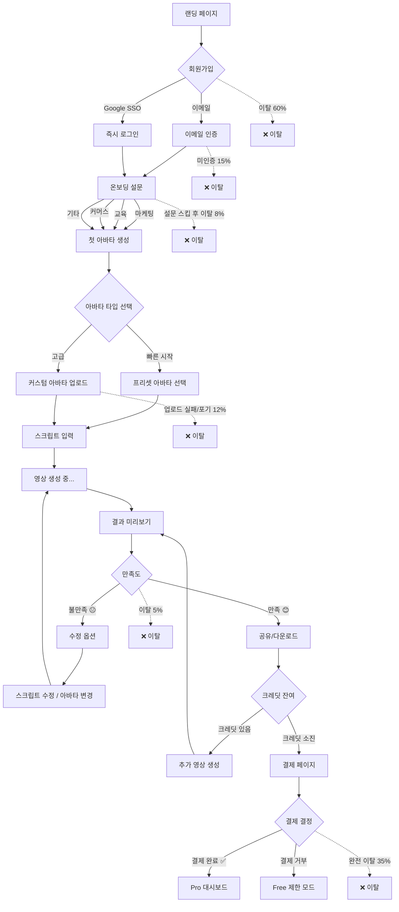
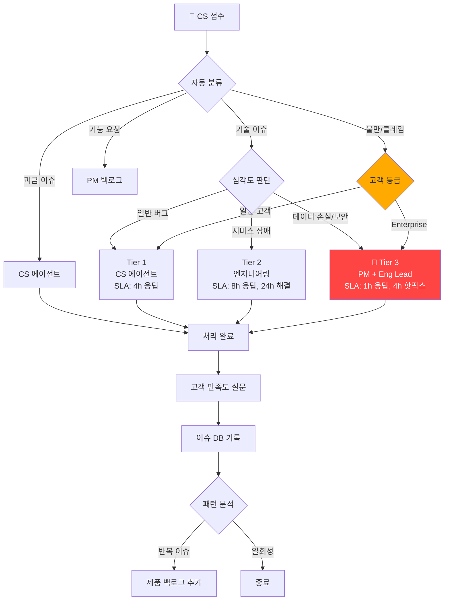

# 유즈케이스: 제품 프로세스 플로우차트 문서화

> **PM 역량**: 프로세스 설계 / 시스템 사고 / 커뮤니케이션
> **난이도**: J → P
> **관련 문서**: [5.1-definition-write-prd.md](./5.1-definition-write-prd.md), [6.1-delivery-vibe-coding.md](./6.1-delivery-vibe-coding.md)

---

## 왜 PM에게 필요한가?

PM은 끊임없이 프로세스를 설계하고 문서화합니다: 사용자 온보딩 플로우, 결제 프로세스, 에스컬레이션 절차, 릴리즈 파이프라인. 하지만 복잡한 프로세스를 시각화하는 것은 시간이 많이 걸리고, Lucidchart나 Miro에서 박스를 하나하나 그리는 작업은 PM의 핵심 업무가 아닙니다.

Claude Code는 **텍스트 설명 → Mermaid 다이어그램 → 시각화 가능한 코드**를 즉시 생성합니다. PM은 "프로세스를 설명"하면 되고, 시각화는 Claude가 처리합니다.

---

## 상황

당신은 AI Avatar 서비스의 PM입니다. 다음 3가지 프로세스를 문서화해야 합니다:

1. **사용자 온보딩 플로우**: 가입 → 첫 아바타 생성 → 결제 전환까지
2. **고객 에스컬레이션 프로세스**: CS 접수 → 분류 → 해결까지
3. **릴리즈 프로세스**: 기획 → 개발 → QA → 배포까지

각각 다른 이해관계자(디자이너, CS팀, 엔지니어링)에게 공유해야 합니다.

---

## 기존 방식 vs Claude 방식

```
기존 (반일~1일, 프로세스당):
1. 프로세스 정리 (화이트보드/노트)
2. Lucidchart/Miro에서 박스 그리기
3. 분기점, 조건 추가
4. 색상, 스타일 정리
5. 이해관계자 리뷰 → 수정 반복

Claude (15~30분, 프로세스당):
1. 텍스트로 프로세스 설명 → Mermaid 코드 생성 (5분)
2. PM 리뷰 → 수정 요청 (5분)
3. 최종 Mermaid를 Notion/Confluence에 붙여넣기 (5분)
```

---

## 워크스루

### Step 1: 온보딩 플로우 생성

```
Terminal 입력:
> AI Avatar 서비스의 사용자 온보딩 플로우차트를 Mermaid로 만들어줘.

  플로우:
  1. 랜딩 페이지 도착
  2. 회원가입 (이메일 or Google SSO)
  3. 온보딩 설문 (용도 선택: 마케팅/교육/커머스/기타)
  4. 첫 아바타 생성 가이드
     - 프리셋 아바타 선택 (빠른 시작)
     - 커스텀 아바타 업로드 (고급)
  5. 첫 영상 생성
  6. 결과 미리보기
  7. 분기점: 만족하면 → 공유/다운로드 → 결제 유도
              불만족하면 → 수정 옵션 → 재생성
  8. 무료 크레딧 소진 시 → 결제 페이지
  9. 결제 완료 → 대시보드

  각 단계에서 이탈 가능한 지점도 표시해줘.
  그리고 각 단계의 예상 전환율도 코멘트로 넣어줘.

Claude Code 응답:



전체 퍼널 전환율 요약:

| 단계 | 전환율 | 업계 벤치마크 | 상태 |
| --- | --- | --- | --- |
| 랜딩 → 가입 | 40% | 25~35% | ✅ 양호 |
| 가입 → 첫 생성 | 72% | 60~70% | ✅ 양호 |
| 첫 생성 → 결제 페이지 | 45% | 30~40% | ✅ 양호 |
| 결제 페이지 → 결제 | 65% | 50~60% | ✅ 양호 |
| **전체 (랜딩 → 유료)** | **8.2%** | **3\~7%** | ✅ 상위 |

⚠️ [PM 확인 필요]
위 전환율은 가정입니다. 실제 퍼널 데이터로 교체하세요.
Amplitude/Mixpanel에서 실제 수치를 가져오면 더 정확합니다.
```
### Step 2: 에스컬레이션 프로세스
```
Terminal 입력:
> 고객 에스컬레이션 프로세스도 만들어줘.

  플로우:
  1. CS 접수 (채팅/이메일/전화)
  2. 자동 분류 (봇): 기술 이슈 / 과금 이슈 / 기능 요청 / 불만
  3. 티어 분류:
    - Tier 1 (일반): CS 에이전트가 즉시 처리
    - Tier 2 (기술): 엔지니어링 팀 에스컬레이션
    - Tier 3 (긴급): PM + 엔지니어링 리드 합동 대응
  1. SLA:
    - Tier 1: 4시간 이내 응답
    - Tier 2: 8시간 이내 응답, 24시간 이내 해결
    - Tier 3: 1시간 이내 응답, 4시간 이내 핫픽스
  1. 해결 후: 고객 만족도 설문 → 이슈 DB 기록

  Tier 3 경로를 빨간색으로 강조해줘.

Claude Code 응답:


```
### Step 3: 프로세스 비교 및 개선점 도출
```
Terminal 입력:
> 현재 온보딩 플로우에서 개선할 수 있는 지점을 분석해줘.
  특히:
  1. 이탈률이 가장 높은 단계
  2. 단계를 줄일 수 있는 곳
  3. A/B 테스트 우선순위 제안

  현재 플로우와 개선안 플로우를 나란히 비교하는 형태로.

Claude Code 응답:

## 개선 분석

### 최대 이탈 지점 (Impact × Volume 기준)

| 순위 | 단계 | 이탈률 | 예상 영향 | 개선안 |
| --- | --- | --- | --- | --- |
| 1 | 랜딩→가입 | 60% | 가장 큰 볼륨 손실 | SSO 원클릭 강화, 가입 전 데모 |
| 2 | 결제 페이지→결제 | 35% | 매출 직접 영향 | 가격 앵커링, 소셜 프루프 |
| 3 | 커스텀 업로드 실패 | 12% | 고가치 유저 이탈 | 업로드 가이드 + 실패 시 프리셋 제안 |

### A/B 테스트 우선순위

1. 🥇 "가입 전 데모 체험" — 가입 없이 프리셋 아바타 체험 후 저장 시 가입
2. 🥈 "결제 페이지 소셜 프루프" — 유사 업종 고객 사례 + ROI 수치 표시
3. 🥉 "업로드 실패 → 프리셋 폴백" — 업로드 실패 시 자동 프리셋 제안
```
---

## PM 판단 포인트

### ❓ "Mermaid 다이어그램으로 충분한가? Figma가 더 좋지 않나?"
```
Mermaid의 장점:
- 텍스트 기반 → 버전 관리 가능 (Git)
- 수정이 빠름 (박스 드래그 대신 텍스트 수정)
- Notion, GitHub, Confluence에서 바로 렌더링
- "프로세스 변경 이력"을 diff로 추적 가능

Figma/Lucidchart가 더 나은 경우:
- 외부 프레젠테이션용 (시각적 완성도)
- 비개발자 이해관계자 대상
- 복잡한 인터랙티브 프로토타입

PM 판단 기준:
→ "내부 문서화 + 빠른 반복" = Mermaid
→ "외부 발표 + 시각적 임팩트" = Figma
→ 둘 다 필요하면: Mermaid로 초안 → Figma로 마감
```
### ❓ "전환율 수치를 Claude가 추정한 건데, 믿어도 되나?"
```
절대 그대로 사용하면 안 됩니다.

Claude가 제공하는 전환율은:
- 업계 벤치마크 기반 추정
- "이 정도 범위가 일반적이다"는 참고값

PM이 해야 하는 것:
1. Amplitude/Mixpanel에서 실제 퍼널 데이터 추출
2. Claude 추정 vs 실제 수치 비교
3. 실제 수치가 벤치마크 대비 낮으면 → 개선 기회
4. 실제 수치가 벤치마크 대비 높으면 → 유지/강화

→ Claude의 플로우차트를 "데이터를 채울 빈칸이 있는 프레임"으로
  활용하세요. 프레임은 Claude, 숫자는 PM.
```
---

## 고급: 프로세스 자동 문서화
```
Terminal 입력:
> 우리 팀의 주요 프로세스 5개를 Mermaid로 문서화해서
  /docs/processes/ 폴더에 저장해줘.

  1. onboarding-flow.md — 사용자 온보딩
  2. escalation-process.md — 에스컬레이션
  3. release-pipeline.md — 릴리즈 파이프라인
  4. feature-request-flow.md — 기능 요청 처리
  5. incident-response.md — 장애 대응

  각 문서에 포함:
  - Mermaid 다이어그램
  - 각 단계 설명 (담당자, SLA, 입출력)
  - 알려진 병목/개선 기회
  - 마지막 업데이트 일자
```
---

## 실습 과제

### Level 1 (J): 단일 프로세스 시각화
자신이 담당하는 제품의 핵심 프로세스 1개를 Mermaid 플로우차트로 만드세요. Notion이나 GitHub에 삽입하여 팀에 공유하세요.

### Level 2 (P): 퍼널 + 데이터 분석
온보딩 또는 결제 플로우를 작성하고, 실제 전환율 데이터를 매핑하세요. 최대 이탈 지점에 대한 A/B 테스트 계획을 세우세요.

### Level 3 (L): 프로세스 라이브러리
팀의 주요 프로세스 5개 이상을 문서화하는 라이브러리를 구축하세요. 분기별 자동 리뷰(프로세스 변경사항 감지)를 설정하세요.

---

**다음 유즈케이스**: [A.10-usecase-content-adaptation.md](./A.10-usecase-content-adaptation.md) — 크로스 플랫폼 콘텐츠 적응


---

> **© 2026 김생근 (Sanguine Kim)** | AI Agent Lead & AI Tutor
> 본 자료는 [CC BY-NC 4.0](https://creativecommons.org/licenses/by-nc/4.0/) 라이선스를 따릅니다.
> 교육·학술 목적 자유 이용 가능 | 상업적 이용 시 별도 라이선스 필요
> 강의·기업 교육·상업적 활용 문의: kimsanguine@gmail.com
```