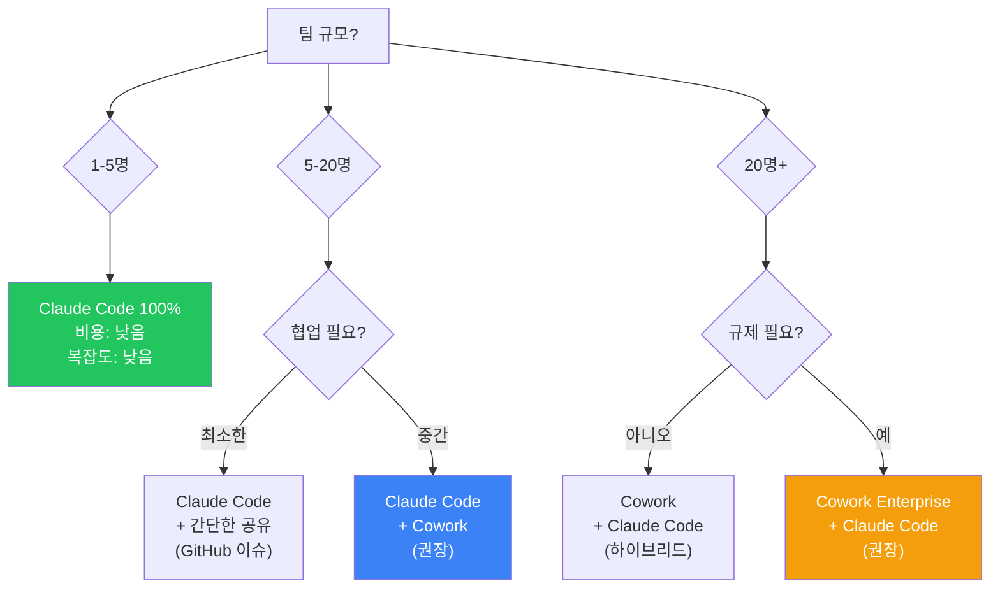

# 1.4 IDE 선택 기준: Claude Code vs Cowork (2026년)

## 개요

2026년 Anthropic은 두 가지 IDE를 제공한다. 각각 다른 철학과 용도를 가지고 있다. **어떤 도구를 쓸지 결정하는 것**이 AI PM의 생산성을 크게 좌우한다.

---

## 빠른 선택 기준

```
당신의 팀 규모?
├─ 1-5명 스타트업/개인
│  └─ → Claude Code (빠르고 경량)
│
├─ 5-20명 성장기 팀
│  └─ → Claude Code + Cowork 병행
│
└─ 20명 이상 엔터프라이즈
   └─ → Cowork Enterprise (중심) + Claude Code (보조)
```

---

## 상세 비교표

| 항목 | Claude Code | Cowork |
|------|------------|--------|
| **IDE 형태** | 터미널 기반 | GUI (앱 또는 웹) |
| **플랫폼** | macOS, Windows, Linux | macOS, Windows, 웹 |
| **시작 속도** | 즉시 (터미널 1줄) | 앱 실행 필요 (10초) |
| **학습곡선** | 가파름 (커맨드라인) | 낮음 (UI 직관적) |
| **주요 강점** | 스크립트화, 빠른 반복 | 팀 협업, 시각화, 모니터링 |
| **플러그인** | 없음 | ✅ PowerPoint, Excel, 서드파티 |
| **예약 작업** | `/loop` (Cron 스타일) | Scheduled Tasks (UI 드래그) |
| **원격 제어** | Remote Control (터미널 접근) | Dispatch (UI 기반 제어) |
| **프로젝트 관리** | TaskCreate/TaskList (Markdown) | Projects (DB 같은 구조) |
| **팀 협업** | 없음 (단일 사용자) | ✅ 팀 멤버 초대, 권한 관리 |
| **엔터프라이즈 기능** | 없음 | ✅ SSO, Audit Trails, Cowork Enterprise |
| **비용** | 포함됨 (Claude Code) | 포함됨 (Cowork) |
| **운영 복잡도** | 낮음 | 중간 (팀 관리 필요) |
| **성능** | 매우 빠름 (경량) | 약간 느림 (UI 오버헤드) |

---

## 각 도구의 철학

### Claude Code: "빠른 개발자를 위한 도구"

```
목표: 최소 지연으로 최대 생산성

특징:
✅ 터미널 기반 → 마우스 이동 없음
✅ 스크립트화 가능 → 반복 자동화
✅ 경량 → 로컬 머신에서 빠름
✅ /loop → Cron 같은 백그라운드 작업

이상적인 사용자:
- 개발자, PM (기술적 배경)
- 프로토타입, 실험 단계
- 빠른 반복이 중요한 프로젝트
```

### Cowork: "팀이 함께 하는 도구"

```
목표: 팀 협업과 가시성

특징:
✅ 그래픽 UI → 진입장벽 낮음
✅ Projects → 팀 태스크 공유
✅ Scheduled Tasks → 드래그 스케줄
✅ Dispatch → 팀원이 원격 제어 가능
✅ Audit Trails → 감사 추적

이상적인 사용자:
- PM, 비기술 팀원
- 팀 프로젝트 (2명 이상)
- 규제/감시가 필요한 환경
```

---

## 실제 시나리오별 추천

### 시나리오 1: 스타트업 (1-3명)

```
상황:
- PM + 개발자 2명
- 빠른 프로토타입 필요
- 비용 중요

추천: Claude Code 100%

이유:
✅ 빠른 반복 (1시간 단위 배포)
✅ 스크립트화 가능 (PM이 자동화)
✅ 추가 비용 없음
✅ 팀 규모 작아서 협업 UI 불필요

워크플로우:
PM → /plan, /qa, /ship
개발자 → /code, /test
자동화 → /loop 08:00 /plan (매일 자동)
```

### 시나리오 2: 성장기 팀 (5-10명)

```
상황:
- PM, 개발자 3명, 디자이너 2명, 마케터
- 주간 배포 (1주 1회)
- 팀 동기화 필요

추천: Claude Code (메인) + Cowork (협업용)

배분:
Claude Code:
- /loop로 일일 자동화 (08:00 /plan, 18:00 배포)
- 빠른 버그 수정, 실험

Cowork:
- 주간 프로젝트 보드 (마케터, 디자이너용)
- Scheduled Tasks로 월간 리포트
- Teams 채널과 연동

워크플로우:
1. PM이 Cowork에서 주간 계획 입력
2. Claude Code가 /loop로 일일 실행
3. 금요일 Cowork에서 결과 시각화
4. 팀 미팅에서 리뷰
```

### 시나리오 3: 엔터프라이즈 (20명+)

```
상황:
- PM팀 5명, 개발팀 10명, 디자인/마케팅 5명
- 규정 준수(SOC2, ISO) 필요
- 감시(audit) 필요
- 24/7 운영

추천: Cowork Enterprise (중심) + Claude Code (고급 사용자)

배분:
Cowork Enterprise (90%):
- SSO 인증
- Audit Trails 로깅
- Projects = 마스터 프로젝트 보드
- Scheduled Tasks = 팀 자동화
- Dispatch = 원격 제어 (승인 워크플로우)

Claude Code (10%):
- 성숙한 개발자들의 고속 반복
- 복잡한 분석/시뮬레이션
- /loop로 배경 작업

워크플로우:
1. Cowork Enterprise Projects에 주간 OKR 입력
2. Cowork Scheduled Tasks로 자동 진행률 업데이트
3. Dispatch로 팀원들이 우선순위 조정
4. Audit Trails에 모든 변경사항 기록
5. Claude Code 사용자는 고급 분석만 /loop로 실행
```

---

## 도구별 강점 활용 가이드

### Claude Code가 빛나는 순간

```
✅ 1회성 자동화
/simplify src/
→ 코드 정리 (10분)

✅ 빠른 버그 수정
/qa --fast
→ QA 실행 (2분)

✅ 일일 반복 작업
/loop 08:00 /discover
/loop 14:00 /qa
→ 매일 자동 (0분 PM 개입)

✅ 복잡한 분석
전체 코드베이스 1M context로 분석
→ 성능 병목 발견

✅ 스크립트 기반 워크플로우
#!/bin/bash
claude-code /plan && /qa && /ship
→ 자동 배포 파이프라인
```

### Cowork가 빛나는 순간

```
✅ 팀 동기화
Cowork Projects에 주간 계획 입력
→ 모든 팀원이 즉시 볼 수 있음

✅ 비기술자 자동화
Scheduled Tasks에서 드래그 드롭
→ PM이 코딩 없이 스케줄 작성

✅ 승인 워크플로우
Dispatch로 원격 제어
→ 팀원이 휴대폰에서 배포 승인

✅ 감시/준수
Audit Trails에 모든 작업 기록
→ 규제 요구사항 충족

✅ 시각화된 리포트
Cowork Projects 보드
→ 마케터, 경영진도 쉽게 이해
```

---

## 전환 가이드

### Claude Code → Cowork로 확대할 때 (팀 5명 이상)

```
Phase 1: Cowork 도입 (1주)
- Cowork Enterprise 가입 (혹은 개인 Cowork)
- 팀원 초대
- Projects 보드 설정

Phase 2: 프로젝트 마이그레이션 (2주)
- Claude Code의 TaskCreate/List
  → Cowork Projects로 마이그레이션
- TaskCreate 스크립트 → Cowork API로 변경

Phase 3: 자동화 전환 (2주)
- Claude Code의 /loop
  → Cowork Scheduled Tasks로 마이그레이션
- 일부 복잡한 작업은 Claude Code 유지

Phase 4: 통합 (진행 중)
- Claude Code로 분석
- Cowork로 팀 공유
- Dispatch로 승인 및 실행
```

### 하이브리드 워크플로우 (권장)

```
최고의 생산성:

┌─ Claude Code (전략, 분석)
│  ├─ /plan: 1M context로 전체 분석
│  ├─ /discover: 새로운 기회 탐색
│  └─ /analyze: 복잡한 데이터 분석
│
├─ Cowork (팀 공유, 승인)
│  ├─ Projects: 결과를 팀에 공유
│  ├─ Scheduled Tasks: 주간 리포트 자동화
│  └─ Dispatch: 팀원 승인 받기
│
└─ Claude Code (배포)
   ├─ /qa: 자동 테스트
   └─ /ship: 배포 실행

이 흐름으로 "분석 → 승인 → 실행"의 완전 자동화
```

---

## 의사결정 트리



---

## 마이그레이션 체크리스트

### Claude Code만 사용 중이라면

- [ ] 팀이 5명 이상인가?
- [ ] 주 1회 이상 "팀과 공유"하는 작업이 있는가?
- [ ] 승인 워크플로우가 필요한가?

**하나라도 Yes면 Cowork 추가 고려**

### 이미 Cowork를 사용한다면

- [ ] 여전히 복잡한 분석을 수동으로 하는가?
- [ ] 반복적인 작업을 UI에서 수동으로 하는가?

**Yes라면 Claude Code 병행 권장**

---

## 최종 권장사항

### 2026년 최고의 조합: "하이브리드 접근"

```
┌─────────────────────────────────────────┐
│    Claude Code + Cowork Enterprise      │
├─────────────────────────────────────────┤
│                                         │
│ Claude Code 담당:                       │
│ ✓ 전략적 분석 (1M Context)              │
│ ✓ 빠른 프로토타입                       │
│ ✓ 자동화 /loop                         │
│                                         │
│ Cowork Enterprise 담당:                 │
│ ✓ 팀 협업 & 승인                        │
│ ✓ 규정 준수 (Audit)                     │
│ ✓ 비기술자를 위한 UI                    │
│                                         │
│ 결과: 분석 + 협업 + 실행의 완전 자동화   │
└─────────────────────────────────────────┘
```

---

> **🔗 관련 파트**
> - [4.7-automation-team-design.md](./4.7-automation-team-design.md): `/loop` vs Cowork Scheduled Tasks 심화
> - [2.3-install-and-first-run.md](./2.3-install-and-first-run.md): 각 도구 설치 방법
> - [3.5-agent-teams.md](./3.5-agent-teams.md): 팀 규모별 에이전트 구성

---

> **© 2026 김생근 (Sanguine Kim)** | AI Agent Lead & AI Tutor
> 본 자료는 [CC BY-NC 4.0](https://creativecommons.org/licenses/by-nc/4.0/) 라이선스를 따릅니다.
> 교육·학술 목적 자유 이용 가능 | 상업적 이용 시 별도 라이선스 필요
> 강의·기업 교육·상업적 활용 문의: kimsanguine@gmail.com
