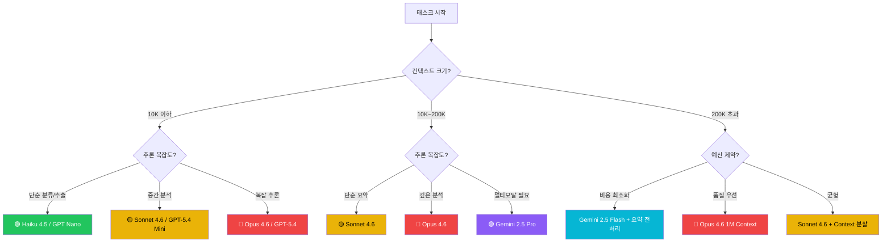

# 3.6 멀티모델 라우팅: 어떤 AI에게 어떤 일을 맡길 것인가

## 왜 멀티모델 라우팅인가

2026년 3월, PM이 사용할 수 있는 AI 모델은 더 이상 하나가 아니다. Claude 4.6 (Opus/Sonnet/Haiku), GPT-5.4, Gemini 2.5 — 각각의 성능, 가격, 특화 영역이 다르다.

**핵심 질문**: "어떤 모델을 쓸까?"는 이제 엔지니어만의 결정이 아니라 **PM의 비용-품질 의사결정**이다.

잘못된 모델 선택의 대가:
- Opus로 단순 요약을 돌리면 → 5배 비용 낭비
- Haiku로 전체 코드리뷰를 돌리면 → 품질 미달로 재작업
- 고정 모델 하나만 쓰면 → 비용 또는 품질 중 하나를 포기

**멀티모델 라우팅**은 태스크의 복잡도, 컨텍스트 크기, 비용 제약에 따라 최적의 모델을 자동/수동으로 선택하는 전략이다.

---

## 2026년 3월 AI 모델 성능/가격 비교표

| 모델 | Input ($/1M tokens) | Output ($/1M tokens) | Context Window | 특화 영역 | SWE-bench |
|------|---------------------|----------------------|----------------|-----------|-----------|
| **Claude Opus 4.6** | $5.00 | $25.00 | 1M | 최고 추론, 장문맥 분석 | 80.8% |
| **Claude Sonnet 4.6** | $3.00 (≤200K) / $6.00 (>200K) | $15.00 / $22.50 | 1M | 균형형 (비용 대비 성능) | 80.8% |
| **Claude Haiku 4.5** | $1.00 | $5.00 | 200K | 빠른 응답, 분류/요약 | — |
| **GPT-5.4** | $2.50 | $15.00 | 1M | Computer Use, 추론 | 80.0% |
| **GPT-5.4 Mini** | $0.75 | $4.50 | — | 경량 처리 | — |
| **GPT-5.4 Nano** | $0.20 | $1.25 | — | 초경량 (분류, 추출) | — |
| **Gemini 2.5 Pro** | $1.25 (≤200K) / $2.50 (>200K) | $10.00 / $20.00 | 1M | 수학, 과학, 멀티모달 | — |
| **Gemini 2.5 Flash** | $0.30 | $2.50 | 1M | 빠른 추론, 최저 비용 | — |

**핵심 인사이트:**
- **가격 범위가 125배**: Nano($0.20/M) ~ Opus($5.00/M). 모든 태스크에 같은 모델을 쓰면 돈을 태우거나 품질을 버리는 것이다.
- **200K 경계**: Sonnet과 Gemini Pro 모두 200K tokens 초과 시 가격이 2배로 뛴다. 이 경계를 넘을지 말지가 의사결정 분기점이다.
- **장문맥 신뢰도**: 1M context에서 Opus 4.6의 MRCR(Multi-Round Context Retrieval) 점수는 76%, Sonnet 4.5는 18.5%. 장문맥은 Opus 필수다.

---

## 태스크별 모델 선택 의사결정 트리

PM이 "이 작업에 어떤 모델을 쓸까?"를 판단할 때 사용하는 프레임워크다.



**의사결정 3축:**
1. **컨텍스트 크기**: 입력 토큰 수가 가격 티어를 결정한다
2. **추론 복잡도**: 단순 분류 vs 다단계 분석 vs 창의적 생성
3. **비용 제약**: 호출당 예산 상한이 모델 범위를 좁힌다

---

## 실전 사례 3가지

### 사례 1: 전체 코드베이스 리뷰 (1M Context) → Opus 필수

**상황**: PM이 인수 검토 중인 스타트업의 코드베이스 전체(약 3,000 파일, 600K tokens)를 한 번에 분석해야 한다.

```bash
> 이 레포의 전체 코드를 리뷰해줘.
  - 아키텍처 패턴 분석
  - 기술 부채 식별
  - 보안 취약점 스캔
  - 테스트 커버리지 평가
```

**모델 선택 근거:**
- 컨텍스트: 600K tokens → 200K 초과 → 장문맥 필수
- 추론: 아키텍처 분석 + 보안 스캔 = 고복잡도
- **Opus 4.6 선택** (MRCR 76% @ 1M)
- Sonnet 불가: 1M에서 MRCR 18.5% → 중간 파일의 이슈를 놓침

**비용 계산:**
- Input: 600K tokens × $5.00/M = $3.00
- Output: ~50K tokens × $25.00/M = $1.25
- **총 $4.25** — 수동 코드리뷰 3일(인건비 $2,000+) 대비 0.2%

---

### 사례 2: 주간 경쟁사 리포트 (100K Context) → Sonnet 최적

**상황**: 매주 경쟁사 5곳의 뉴스/블로그/릴리즈 노트를 수집해서 분석 리포트를 생성한다. 총 입력 약 100K tokens.

```bash
> @competitor-data/ 이 폴더의 경쟁사 자료를 분석해서
  주간 경쟁사 리포트를 작성해줘.
  - 각 사별 주요 변화
  - 우리에게 미치는 영향
  - 대응 권고사항
```

**모델 선택 근거:**
- 컨텍스트: 100K tokens → 200K 이하 → 표준 가격
- 추론: 구조화된 분석 = 중간 복잡도
- **Sonnet 4.6 선택** (200K 이하 $3.00/M)
- Opus 대비 40% 저렴하면서 이 규모에서는 품질 차이 미미

**비용 계산:**
- Input: 100K × $3.00/M = $0.30
- Output: ~20K × $15.00/M = $0.30
- **총 $0.60/주** — 월 $2.40

---

### 사례 3: 사용자 피드백 분류 (2K/건) → Haiku 최적

**상황**: 일 500건의 고객 피드백을 감성(긍정/부정/중립), 주제(기능요청/버그/가격/UI), 긴급도(상/중/하)로 분류한다.

```bash
> 이 피드백을 분류해줘:
  - 감성: 긍정/부정/중립
  - 주제: 기능요청/버그/가격/UI/기타
  - 긴급도: 상/중/하

  피드백: "로딩이 너무 느려서 다른 앱으로 갈아탔어요"
```

**모델 선택 근거:**
- 컨텍스트: 2K tokens/건 → 극소량
- 추론: 3축 분류 = 단순
- **Haiku 4.5 선택** ($1.00/M input)
- 500건/일 = 1M tokens/일 → 일 $1.00

**비용 비교 (500건/일 기준):**
| 모델 | 일 비용 | 월 비용 | 품질 |
|------|---------|---------|------|
| Opus 4.6 | $5.00 | $150.00 | 과잉 품질 |
| Sonnet 4.6 | $3.00 | $90.00 | 불필요한 비용 |
| **Haiku 4.5** | **$1.00** | **$30.00** | **충분** |
| GPT Nano | $0.20 | $6.00 | 경계선 |

---

## 라우팅 구현: Python ModelRouter

PM이 엔지니어에게 전달할 수 있는 모델 라우팅 로직이다. 실제 프로덕션에서 사용 가능한 수준의 코드다.

```python
"""
model_router.py — AI 모델 라우팅 엔진
태스크의 컨텍스트 크기, 추론 복잡도, 비용 예산에 따라 최적 모델을 선택한다.
"""
from dataclasses import dataclass
from enum import Enum


class Complexity(Enum):
    LOW = "low"          # 분류, 추출, 간단 요약
    MEDIUM = "medium"    # 구조화 분석, 리포트 생성
    HIGH = "high"        # 다단계 추론, 장문맥 분석, 전략 수립


class Budget(Enum):
    MINIMAL = "minimal"  # 호출당 $0.01 이하
    BALANCED = "balanced" # 호출당 $0.01~$1.00
    UNLIMITED = "unlimited" # 품질 우선, 비용 무시


@dataclass
class ModelConfig:
    name: str
    input_price: float   # $/1M tokens
    output_price: float  # $/1M tokens
    max_context: int     # tokens
    strengths: list[str]


# 2026년 3월 기준 모델 카탈로그
MODELS = {
    "opus": ModelConfig("claude-opus-4-6", 5.00, 25.00, 1_000_000,
                        ["deep_reasoning", "long_context", "code_review"]),
    "sonnet": ModelConfig("claude-sonnet-4-6", 3.00, 15.00, 1_000_000,
                          ["balanced", "analysis", "writing"]),
    "sonnet_long": ModelConfig("claude-sonnet-4-6", 6.00, 22.50, 1_000_000,
                               ["long_context_balanced"]),
    "haiku": ModelConfig("claude-haiku-4-5", 1.00, 5.00, 200_000,
                         ["classification", "extraction", "fast"]),
    "gemini_flash": ModelConfig("gemini-2.5-flash", 0.30, 2.50, 1_000_000,
                                ["multimodal", "fast", "cheap"]),
    "gpt_nano": ModelConfig("gpt-5.4-nano", 0.20, 1.25, 128_000,
                            ["classification", "ultra_cheap"]),
}


def select_model(
    context_tokens: int,
    complexity: Complexity,
    budget: Budget = Budget.BALANCED,
    needs_multimodal: bool = False,
) -> ModelConfig:
    """태스크 특성에 따라 최적 모델을 선택한다."""

    # 멀티모달 필요 시 Gemini 우선
    if needs_multimodal and context_tokens <= 200_000:
        return MODELS["gemini_flash"]

    # 장문맥 (200K 초과)
    if context_tokens > 200_000:
        if budget == Budget.MINIMAL:
            return MODELS["gemini_flash"]
        if complexity == Complexity.HIGH or budget == Budget.UNLIMITED:
            return MODELS["opus"]
        return MODELS["sonnet_long"]

    # 표준 컨텍스트 (200K 이하)
    if complexity == Complexity.LOW:
        if budget == Budget.MINIMAL:
            return MODELS["gpt_nano"]
        return MODELS["haiku"]

    if complexity == Complexity.MEDIUM:
        return MODELS["sonnet"]

    # HIGH complexity, 200K 이하
    if budget == Budget.UNLIMITED:
        return MODELS["opus"]
    return MODELS["sonnet"]


def estimate_cost(
    model: ModelConfig,
    input_tokens: int,
    output_tokens: int = 0,
) -> float:
    """예상 비용을 달러로 계산한다."""
    if output_tokens == 0:
        output_tokens = int(input_tokens * 0.15)  # 기본: input의 15%
    cost = (input_tokens * model.input_price + output_tokens * model.output_price) / 1_000_000
    return round(cost, 4)


# --- 사용 예시 ---
if __name__ == "__main__":
    # 사례 1: 코드베이스 전체 리뷰
    m1 = select_model(600_000, Complexity.HIGH, Budget.UNLIMITED)
    print(f"코드리뷰 → {m1.name}, 예상 비용: ${estimate_cost(m1, 600_000, 50_000)}")

    # 사례 2: 주간 경쟁사 분석
    m2 = select_model(100_000, Complexity.MEDIUM)
    print(f"경쟁사 분석 → {m2.name}, 예상 비용: ${estimate_cost(m2, 100_000, 20_000)}")

    # 사례 3: 피드백 분류 (1건)
    m3 = select_model(2_000, Complexity.LOW, Budget.MINIMAL)
    print(f"피드백 분류 → {m3.name}, 예상 비용: ${estimate_cost(m3, 2_000, 500)}")
```

**실행 결과:**
```
코드리뷰 → claude-opus-4-6, 예상 비용: $4.25
경쟁사 분석 → claude-sonnet-4-6, 예상 비용: $0.6
피드백 분류 → gpt-5.4-nano, 예상 비용: $0.0010
```

---

## 라우팅 패턴: 단일 모델 vs 멀티모델

### 패턴 A: 단일 모델 (안티패턴)

```
모든 태스크 → Sonnet 4.6
```

- 장점: 단순함
- 단점: 단순 분류에 $3/M 지불 (15배 과지불), 장문맥에서 품질 미달

### 패턴 B: 2단계 라우팅 (권장 시작점)

```
단순/반복 → Haiku
그 외 → Sonnet
```

- 이것만으로도 60~70% 비용 절감 가능

### 패턴 C: 풀 라우팅 (성숙 단계)

```
분류/추출 → Haiku or Nano
분석/생성 → Sonnet
장문맥/고복잡 → Opus
멀티모달 → Gemini
```

- 태스크 유형별 최적화, 비용 80% 이상 절감 가능

---

## 🤔 PM 판단 포인트: 라우팅 실전 딜레마

### 딜레마 1: "품질 차이를 모르겠는데 비싼 모델을 써야 하나?"

**해결법**: A/B 테스트 먼저.
- 같은 태스크를 Haiku/Sonnet/Opus로 각각 10건 돌린다
- 결과를 비교해서 **체감할 수 있는 품질 차이**가 있는 경우에만 상위 모델 사용
- 차이가 없으면 저렴한 모델이 정답이다

### 딜레마 2: "Sonnet 200K 경계에서 204K가 나왔다"

- 4K tokens 때문에 가격이 2배($3→$6/M)
- **해결법**: Context 압축 시도. 불필요한 whitespace, 중복 데이터 제거로 200K 아래로 맞출 수 있으면 50% 절약
- 안 되면 Opus로 가는 것도 방법 ($5/M vs Sonnet $6/M — Opus가 오히려 저렴)

### 딜레마 3: "팀원마다 다른 모델을 쓰면 결과 일관성이 깨진다"

- **해결법**: CLAUDE.md에 모델 라우팅 정책을 명시
- "PRD 리뷰는 Opus, 일일 요약은 Haiku, 코드 분석은 Sonnet" — 팀 전체 통일

---

## 주의사항

### 1. Sonnet의 200K 가격 점프

Sonnet 4.6은 200K tokens 초과 시 **모든 토큰에 대해** 2배 가격이 적용된다. 201K를 보내면 처음 200K도 $6/M으로 청구된다. 이 경계를 넘길 바에는 Opus($5/M)가 더 저렴할 수 있다.

### 2. Lost-in-the-Middle 현상

1M context를 사용하더라도 모델은 입력의 시작과 끝에 더 강한 주의를 기울인다. Anthropic 공식 수치로 90% retrieval accuracy이지만, 이는 10%의 실패를 의미한다. **중요한 정보는 context의 앞이나 뒤에 배치**해야 한다.

### 3. Prompt Caching 활용

동일한 시스템 프롬프트를 반복 사용하면 캐시 할인(최대 90%)을 받을 수 있다. 라우팅과 함께 적용하면 비용을 극적으로 줄일 수 있다.

---

## 실습 과제

### 레벨 1: 따라하기
- `model_router.py`를 실행해서 3가지 사례의 비용을 확인하라
- 자신의 팀에서 가장 자주 쓰는 태스크 3가지를 정의하고, 각각에 최적 모델을 선택하라

### 레벨 2: 변형하기
- 의사결정 트리에 "응답 속도" 축을 추가하라 (P95 latency 기준)
- 자신의 팀 예산 제약을 반영한 커스텀 `Budget` Enum을 만들어라

---

> **🔗 관련 모듈**
> - [8.4-1m-context-cost-strategy.md](./8.4-1m-context-cost-strategy.md): 1M Context 비용 전략 심화
> - [8.1-growth-experiment-analysis.md](./8.1-growth-experiment-analysis.md): A/B 테스트로 모델 품질 비교
> - [8.3-ai-observability.md](./8.3-ai-observability.md): 프로덕션 모델 성능 모니터링

---

> **© 2026 김생근 (Sanguine Kim)** | AI Agent Lead & AI Tutor
> 본 자료는 [CC BY-NC 4.0](https://creativecommons.org/licenses/by-nc/4.0/) 라이선스를 따릅니다.
> 교육·학술 목적 자유 이용 가능 | 상업적 이용 시 별도 라이선스 필요
> 강의·기업 교육·상업적 활용 문의: kimsanguine@gmail.com
