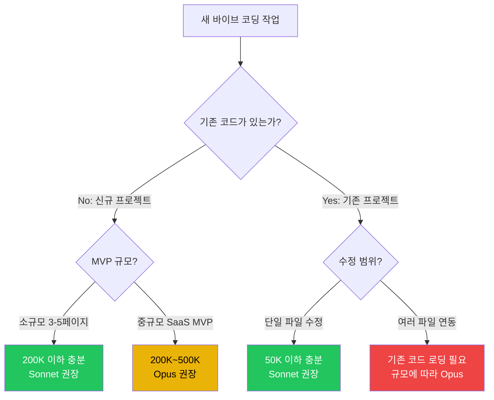

# 6.1 바이브 코딩 v2: 1M Context 시대의 SaaS MVP 만들기

## 바이브 코딩의 진화: 프로토타입에서 MVP로

2026년 3월, 바이브 코딩은 "10분짜리 성격 테스트 앱"을 넘어섰다. Claude 4.6의 1M token context window는 PM이 **하루 안에 실제 작동하는 SaaS MVP**를 만들 수 있게 했다.

**바이브 코딩 v1** (2025):
- 단일 파일 프로토타입
- PM이 한 번에 하나의 기능만 요청
- Context 제한으로 프로젝트 전체를 볼 수 없음
- 결과: "와, 움직인다!" 수준의 데모

**바이브 코딩 v2** (2026, 1M Context):
- 전체 프로젝트 구조를 한 세션에서 설계 + 구현
- 경쟁사 분석 → 유저 리서치 → PRD → 코드 → 테스트를 **한 대화**에서
- Agent Teams로 프론트/백/테스트 병렬 작업
- 결과: "이거 내일 런칭해도 되겠는데?" 수준의 MVP

**핵심 변화**: Context가 커지면서 PM은 "한 번에 한 기능"이 아니라 **"한 번에 전체 제품"**을 다룰 수 있게 되었다.

---

## 1M Context가 바꾸는 워크플로우

### BEFORE: 파편화된 세션 (v1)

```
세션 1: "랜딩 페이지 만들어줘"
세션 2: "회원가입 기능 추가해줘" ← 세션 1의 코드를 기억 못함
세션 3: "대시보드 만들어줘" ← 전체 구조를 다시 설명해야 함
세션 4: "결제 연동해줘" ← 기존 코드와 충돌 발생
```

**문제**: 매 세션마다 context를 다시 쌓아야 하고, 파일 간 일관성이 깨진다.

### AFTER: 통합 세션 (v2, 1M Context)

```
하나의 세션:
  ├─ 전체 PRD + 경쟁사 분석 로딩 (50K tokens)
  ├─ 프로젝트 구조 설계 (5K tokens)
  ├─ 핵심 기능 구현 (200K tokens — 코드 전체)
  ├─ 테스트 작성 + 실행 (50K tokens)
  ├─ 디자인 리뷰 + 수정 (100K tokens)
  └─ 배포 준비 (10K tokens)
  총: ~415K tokens — 1M 안에 여유 있게 완료
```

**결과**: 전체 프로젝트의 맥락을 유지하면서 일관된 코드를 생성한다.

---

## 실전 시나리오 1: SaaS 대시보드 MVP (하루 완성)

### 목표

고객 피드백 분석 SaaS. 피드백을 자동 분류하고 감성 분석 결과를 대시보드로 보여준다.

### 1단계: Context 로딩 — 전체 그림을 한 번에

```bash
$ claude

> @prd/feedback-saas-prd.md
  @competitor-analysis/zendesk.md
  @competitor-analysis/intercom.md
  @user-research/interview-summary.md

  이 자료를 기반으로 고객 피드백 분석 SaaS MVP를 만들 거야.
  핵심 기능:
  1. 피드백 수집 API (웹훅)
  2. 자동 감성 분석 + 주제 분류
  3. 실시간 대시보드 (차트 + 테이블)
  4. Slack 알림 (부정적 피드백 즉시 알림)

  기술 스택: Next.js 15 + Tailwind + Supabase + Vercel
  1일 안에 MVP를 완성할 수 있도록 PLAN.md 먼저 작성해줘.
```

**PM 판단 포인트**: 경쟁사 분석과 유저 리서치를 context에 함께 넣으면, Claude가 경쟁사와 차별화된 기능을 자동으로 제안한다. PRD만 넣었을 때와 품질이 완전히 다르다.

### 2단계: 구조 설계 + 구현 (Agent Teams 활용)

```bash
> PLAN.md를 기반으로 구현을 시작해줘.
  Agent Teams 모드로:
  - Agent 1: API 라우트 + Supabase 스키마 (백엔드)
  - Agent 2: 대시보드 UI + 차트 (프론트엔드)
  - Agent 3: Slack 알림 + 웹훅 연동 (인프라)

  각 에이전트가 동시에 작업하되, 공유 타입 정의(types.ts)는
  먼저 합의하고 시작해.
```

**핵심**: 1M context 덕분에 3개 에이전트 모두 전체 프로젝트 구조를 알고 있다. 타입 불일치, import 오류, API 스펙 불일치가 현저히 줄어든다.

### 3단계: 스크린샷 피드백 루프

```bash
> [대시보드 스크린샷 첨부]

  수정사항:
  1. 감성 분석 차트 — 파이 차트보다 시계열 라인 차트가 낫겠어
     (추이를 봐야 하니까)
  2. 피드백 테이블에 "대응 상태" 컬럼 추가 (미처리/처리중/완료)
  3. 부정적 피드백 카드에 빨간 뱃지 추가

  그리고 @prd/feedback-saas-prd.md의 "핵심 지표" 섹션 다시 확인해서
  대시보드에 빠진 지표가 있으면 알려줘.
```

**1M Context의 위력**: PM이 "PRD를 다시 확인해줘"라고 하면, Claude는 세션 초반에 로딩한 PRD를 즉시 참조한다. 별도의 파일 재로딩 없이.

### 4단계: 배포

```bash
> Vercel에 배포할 수 있게 준비해줘.
  - 환경변수: SUPABASE_URL, SUPABASE_KEY, SLACK_WEBHOOK
  - README.md에 설정 가이드 작성
  - vercel.json 설정

  그리고 현재 프로젝트 전체를 리뷰해서
  보안 문제나 성능 이슈가 있으면 지적해줘.
```

**결과**: 아침에 시작해서 저녁에 MVP가 돌아간다. PRD → 코드 → 배포까지 **한 세션, 한 맥락**.

---

## 실전 시나리오 2: 기존 프로젝트에 새 기능 추가

### 상황

이미 운영 중인 SaaS에 "AI 요약 리포트 자동 생성" 기능을 추가한다. 기존 코드베이스는 150개 파일, 약 300K tokens.

```bash
> 이 프로젝트의 전체 구조를 파악해줘.
  특히:
  1. 데이터 흐름 (피드백 수집 → 저장 → 분석 → 표시)
  2. API 라우트 목록과 각 역할
  3. DB 스키마
  4. 현재 테스트 커버리지

  파악 후, "주간 AI 요약 리포트" 기능을 추가할 때
  가장 적은 변경으로 구현할 수 있는 방법을 제안해줘.
```

**PM 판단 포인트**: "가장 적은 변경"이라는 제약을 명시하는 것이 중요하다. 1M context가 있으면 Claude는 전체 코드를 보고 기존 패턴에 맞는 최소 변경을 제안할 수 있다. 제약 없이 "새 기능 추가해줘"라고 하면 불필요한 리팩토링이 따라온다.

---

## 실전 시나리오 3: 경쟁사 분석 + 코드를 한 세션에서

### 상황

경쟁사가 새 기능을 출시했다. PM이 경쟁사 제품을 분석하고, 우리 제품의 대응 기능을 같은 세션에서 프로토타입한다.

```bash
> @competitor-data/competitor-x-release-notes-march.md
  @competitor-data/competitor-x-pricing-page.html
  @our-product/current-features.md
  @our-product/roadmap-q2.md

  1. 경쟁사 X의 3월 릴리즈를 분석해줘
     - 우리에게 위협이 되는 기능은?
     - 우리의 기존 강점과 겹치는 부분은?
  2. 분석 결과를 기반으로, 우리가 2주 안에 대응할 수 있는
     기능 프로토타입을 만들어줘
  3. 프로토타입은 기존 프로젝트 구조(@our-product/src/)에 맞춰서
```

**1M Context가 없었다면**: 경쟁사 분석은 별도 세션, 프로토타입은 별도 세션. 분석 인사이트가 코드에 자동 반영되지 않는다. 1M Context에서는 **분석 → 판단 → 구현이 하나의 흐름**이다.

---

## PM의 의사결정 포인트 3가지

### 결정 1: "이 작업에 1M Context가 필요한가?"



### 결정 2: "여러 파일을 동시에 수정할 때 어떤 전략?"

| 상황 | 전략 | 이유 |
|------|------|------|
| 파일 5개 이하 수정 | 순차 수정 | Claude가 한 파일씩 확인하며 진행 |
| 파일 10개+ 연동 수정 | Agent Teams | 프론트/백 병렬로 시간 절약 |
| 전체 리팩토링 | 1M Context + Opus | 전체 맥락 유지가 품질의 핵심 |
| DB 스키마 변경 | Plan 모드 먼저 | 영향 범위 확인 후 실행 |

### 결정 3: "재구현 vs 개선 — 어떤 접근?"

**재구현이 나은 경우:**
- 기존 코드가 200줄 이하
- 기술 스택을 변경해야 할 때
- 기존 코드의 구조적 문제가 심각할 때

**개선이 나은 경우:**
- 기존 코드가 잘 동작하고 테스트가 있을 때
- 기존 사용자/팀이 현재 구조에 익숙할 때
- 변경 범위를 최소화해야 할 때 (운영 리스크)

```bash
# 재구현 판단을 Claude에게 맡기는 프롬프트
> 현재 @src/dashboard/ 코드를 분석해줘.
  이 코드를 개선하는 것과 처음부터 다시 만드는 것 중
  어떤 접근이 나은지 판단해줘.
  판단 기준: 1) 현재 코드 품질, 2) 변경 범위, 3) 시간 비용
```

---

## Opus 4.6의 슈퍼파워: Adaptive Thinking과 Fast Mode (2026년 신규)

### Adaptive Thinking — 자동으로 깊이 조절하는 사고

**개념**: Opus 4.6은 문제의 복잡도에 따라 자동으로 "생각"의 깊이를 조절한다.

```
간단한 버그 수정:
- 문제: "이 if문이 작동 안 함"
- Claude의 사고: 빠른 직관적 접근
- 결과: 10초 안에 답

복잡한 리팩토링:
- 문제: "이 150K 코드베이스의 성능 최적화"
- Claude의 사고: 깊은 분석, 전체 영향 범위 고려
- 결과: 2분의 깊은 분석 후 답
```

**PM의 관점에서:**
- PM은 이것을 의식할 필요 없다. Claude가 자동으로 판단한다.
- 복잡도가 높으면 자동으로 더 깊게, 낮으면 더 빠르게
- "이걸 수동으로 관리하는 PM"은 오버헤드만 증가

**활용:**
```bash
$ claude
> 이 500K tokens의 코드베이스 전체에서 보안 취약점을 찾아줘.

# Adaptive Thinking:
# - 5분간 깊은 분석
# - 전체 데이터 흐름 추적
# - 컨텍스트별 취약점 평가 (높은 신뢰도)
```

---

### Fast Mode — 비용 vs 속도의 균형

**Opus 4.6 Fast Mode**: 일반 모드 대비 2.5배 빠른 출력

#### 언제 쓸까? 의사결정 프레임워크

| 상황 | 일반 모드 | Fast Mode | 이유 |
|------|----------|-----------|------|
| 급할 때 (릴리스 직전) | ❌ | ✅ | 속도가 생명 |
| 반복적 수정 (여러 번 호출) | ❌ | ✅ | 누적 시간 절약 |
| 일일 루틴 (/today, /status) | ✅ | ❌ | 비용 대비 효과 낮음 |
| 중요 의사결정 (전략 수립) | ✅ | ❌ | 품질 > 속도 |

#### 비용 비교

```
일반 Opus 4.6:
- 100K input tokens: $0.50
- 10K output tokens: $0.50
- 총: $1.00

Fast Mode:
- 100K input tokens: $0.60
- 10K output tokens: $0.60
- 총: $1.20 (20% 비싸지만 2.5배 빠름)

ROI:
- 작업이 3번 이상 반복되면 Fast Mode가 이김 (누적 시간 절약)
- 한 번만이면 일반 모드가 낫다
```

#### 실제 활용

```bash
# 케이스 1: 디버깅 작업 (반복성 높음)
$ claude --fast /simplify "complex-function.ts"
→ 빠른 첫 결과 (30초)
→ 피드백 → Fast Mode로 빠른 재수정
→ 누적 시간: 2분 (일반 모드면 5분)

# 케이스 2: 일일 /today (반복성 높음, 양이 많음)
/loop 08:00 /today --fast
→ 매일 빠른 브리핑
→ 월간 시간 절약: 2시간

# 케이스 3: 전략 회의 (한 번만)
$ claude /strategy "next-quarter"
→ 품질이 중요하니 일반 모드 사용
→ Fast Mode는 불필요
```

#### PM 체크리스트

- [ ] 이 작업이 정말 급한가? (마감 24시간 이내 ✅)
- [ ] 앞으로 여러 번 반복될 건가? (3회 이상 ✅)
- [ ] 품질 손실이 허용 가능한가? (수정 가능한 산출물 ✅)
- [ ] 월 누적 비용 증가를 감수할 수 있는가? (Budget ✅)

---

## 1M Context의 함정 3가지

### 함정 1: Lost-in-the-Middle

1M tokens를 넣더라도, 모델은 **시작과 끝에 더 강한 주의**를 기울인다. Anthropic 공식 수치로 90% retrieval accuracy — 10%는 중간에 묻힌 정보를 놓친다.

**대응:**
```bash
# 나쁜 예: 중요한 지시가 중간에 묻힘
> @file1.md @file2.md @file3.md ... @file50.md
  그리고 보안 관련 요구사항은 반드시 지켜줘

# 좋은 예: 중요한 지시를 앞과 뒤에 배치
> 보안 요구사항: [구체적 목록]
  @file1.md @file2.md ... @file50.md
  다시 한번 확인: 위의 보안 요구사항을 모든 파일에 적용했는지 검증해줘
```

### 함정 2: Attention 분산

모든 것을 context에 넣으면 Claude의 주의가 분산된다. 경쟁사 분석 5건 + PRD + 코드 200파일을 한 번에 넣으면, 정작 중요한 요구사항의 정확도가 떨어진다.

**대응:** "필요한 것만, 필요한 시점에"
```bash
# Phase 1: 분석 (경쟁사 + PRD만)
> @competitor/ @prd.md 분석해줘

# Phase 2: 구현 (분석 결과 + 코드만)
> 위 분석 결과를 기반으로 @src/ 코드를 수정해줘
```

### 함정 3: 비용 스파이크

1M context 호출 한 번에 Opus 기준 input만 $5. 하루에 10번 호출하면 $50, 한 달이면 **$1,000+**. "일단 다 넣자" 마인드셋은 청구서 폭탄으로 돌아온다.

**대응:** [7.4 비용 전략](./8.4-1m-context-cost-strategy.md) 참조
- 200K 이하로 유지하면 Sonnet $3/M (Opus $5/M 대비 40% 절약)
- Prompt Caching으로 반복 시스템 프롬프트 90% 할인
- 비용 계산기 `roi_calculator.py`로 사전 시뮬레이션

---

## 바이브 코딩 워크플로우: v2 전체 흐름


**PM이 판단하는 지점** (노란색):
1. Plan 리뷰: "이 구조로 가도 되는가?"
2. 품질 게이트: "이 수준이면 사용자에게 보여줄 수 있는가?"
3. Go/No-Go: "배포해도 되는가?"

---

## 🤔 PM 딜레마: 1M Context 시대의 새로운 문제

**상황**: PM이 Claude와 하루 만에 SaaS MVP를 만들었다. 사용자 20명이 실제로 쓰기 시작했고, 유료 전환도 일어나고 있다. 하지만 코드베이스는 PM 혼자 Claude와 만든 것이라 엔지니어링 팀의 코드 리뷰를 받지 않았다.

CTO가 말한다: "이 코드를 프로덕션 기준으로 올리려면 최소 3주가 필요해." 하지만 사용자는 이미 늘어나고 있고, 속도가 생명이다.

**생각해볼 질문:**
- "동작하는 MVP"의 가치와 "엔지니어링 기준을 충족하는 코드"의 가치 — 어느 시점에서 전환해야 하는가?
- PM이 직접 만든 코드를 엔지니어링 팀에 넘길 때, **인수인계 문서**에는 무엇이 포함되어야 하는가?
- 1M context로 전체 코드를 리뷰할 수 있으니, Claude에게 "이 코드의 프로덕션 레디니스를 평가해줘"라고 요청하는 것은 얼마나 신뢰할 수 있는가?

---

## 실습 과제

### 레벨 1: 따라하기

**과제 1**: 시나리오 1의 피드백 분석 SaaS MVP를 직접 만들어보세요.
- PRD 작성 → Context 로딩 → Agent Teams 구현 → 스크린샷 피드백 → 배포
- 목표: 4시간 안에 작동하는 MVP 완성
- 기록: 각 단계별 소요 시간과 반복 횟수

**과제 2**: 기존 프로젝트(아무 오픈소스)의 전체 코드를 context에 로딩하고, "이 프로젝트에 다크 모드를 추가해줘"라고 요청하세요.
- 1M context에서 기존 코드의 패턴을 얼마나 잘 따르는지 관찰
- Lost-in-the-Middle 현상이 발생하는지 확인

### 레벨 2: 변형하기

**과제 1**: 같은 MVP를 "200K 이하 context만 사용"하는 제약으로 만들어보세요. 1M context 사용 시와 비교해서:
- 소요 시간 차이는?
- 코드 일관성 차이는?
- 비용 차이는? (`roi_calculator.py`로 계산)

**과제 2**: Vibe 코딩으로 만든 프로토타입을 엔지니어에게 넘기는 "핸드오프 문서"를 Claude에게 작성하게 하세요. 엔지니어가 실제로 유용하다고 느끼는지 피드백을 받아보세요.

---

> **🔗 관련 모듈**
> - [4.6-multimodel-routing.md](./4.6-multimodel-routing.md): 바이브 코딩에 어떤 모델을 쓸 것인가
> - [8.4-1m-context-cost-strategy.md](./8.4-1m-context-cost-strategy.md): 1M Context 비용 관리
> - [7.2-delivery-visual-assets.md](./7.2-delivery-visual-assets.md): MVP에 비주얼 에셋 추가
> - [7.3-delivery-github-deploy.md](./7.3-delivery-github-deploy.md): Git + Vercel 배포
> - [3.5-agent-teams.md](./3.5-agent-teams.md): Agent Teams 상세 가이드
> - [3.6-human-in-the-loop.md](./3.6-human-in-the-loop.md): Human-in-the-Loop 원칙

---

> **© 2026 김생근 (Sanguine Kim)** | AI Agent Lead & AI Tutor
> 본 자료는 [CC BY-NC 4.0](https://creativecommons.org/licenses/by-nc/4.0/) 라이선스를 따릅니다.
> 교육·학술 목적 자유 이용 가능 | 상업적 이용 시 별도 라이선스 필요
> 강의·기업 교육·상업적 활용 문의: kimsanguine@gmail.com
