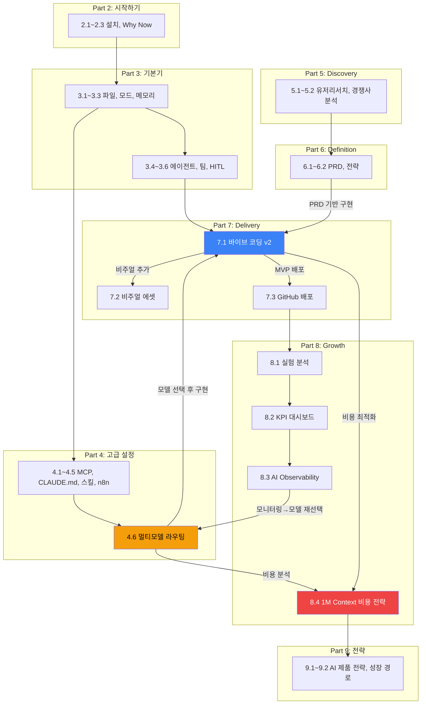

# 브릿지 모듈: Part 간 네비게이션 가이드

## 이 문서의 목적

이 가이드에는 8개 Part, 30+ 개 문서가 있다. 어디서부터 읽어야 할지, 지금 읽고 있는 문서 다음에 뭘 봐야 할지 — 이 문서가 그 길잡이다.

---

## Concept Map: Part 간 의존성 그래프



---

## 3가지 읽기 경로

### 경로 A: 신입 PM의 30분 오리엔테이션 (J 레벨)

```
Part 2 (설치) → Part 3.1~3.3 (기본기) → Part 7.1 (바이브 코딩)
```

- **소요 시간**: 30분 읽기 + 1시간 실습
- **목표**: Claude Code 설치 → 첫 프로토타입 완성
- **선택 확장**: 7.1에서 흥미가 생기면 → 7.2 (비주얼) 또는 7.3 (배포)

### 경로 B: 실무 PM의 비용 최적화 (P 레벨)

```
Part 4.6 (모델 라우팅) → Part 8.4 (1M 비용 전략) → Part 7.1 (바이브 코딩 v2) → Part 8.3 (Observability)
```

- **소요 시간**: 2시간 읽기 + 실습 (model_router.py, roi_calculator.py)
- **목표**: 현재 AI 비용을 50% 이상 최적화
- **선택 확장**: 8.1 (실험 분석)으로 모델 A/B 테스트 설계

### 경로 C: 리드 PM의 전체 시스템 설계 (L 레벨)

```
Part 6.2 (전략) → Part 4.6 (모델 라우팅) → Part 7.1 (바이브 코딩)
→ Part 8.3 (Observability) → Part 8.4 (비용 전략) → Part 9.1 (AI 제품 전략)
```

- **소요 시간**: 4시간+ 읽기 + 코드 실행
- **목표**: AI 제품의 전체 비용-품질-운영 아키텍처 설계
- **핵심**: 8.3→4.6 피드백 루프 (모니터링 데이터로 모델 재선택)가 이 경로의 차별점

---

## Part 간 연결 상세

### 핵심 연결 (반드시 이해해야 하는 흐름)

| From | To | 연결 의미 | 언제 읽나 |
|------|----|----------|----------|
| **4.6** 멀티모델 라우팅 | **7.1** 바이브 코딩 | 모델 선택 → 실제 구현에 적용 | 바이브 코딩 시작 전 |
| **7.1** 바이브 코딩 | **8.4** 1M 비용 전략 | MVP 만들면서 비용 폭주 방지 | 200K+ context 사용 시 |
| **8.3** AI Observability | **4.6** 멀티모델 라우팅 | 프로덕션 데이터로 모델 재선택 | 배포 후 1주일 뒤 |
| **6.1** PRD 작성 | **7.1** 바이브 코딩 | PRD 완성 → 바로 구현 | PRD 리뷰 통과 후 |
| **7.1** 바이브 코딩 | **7.3** GitHub 배포 | MVP 완성 → 배포 | MVP 품질 게이트 통과 시 |

### 보조 연결 (필요할 때 참조)

| From | To | 연결 의미 |
|------|----|----------|
| **7.1** 바이브 코딩 | **7.2** 비주얼 에셋 | MVP에 페르소나, 다이어그램 추가 |
| **7.1** 바이브 코딩 | **3.5** Agent Teams | 병렬 구현의 상세 가이드 |
| **7.1** 바이브 코딩 | **3.6** Human-in-the-Loop | 자동화 수준 조절 원칙 |
| **8.4** 1M 비용 전략 | **8.1** 실험 분석 | 모델 비교를 A/B 테스트로 검증 |
| **4.6** 멀티모델 라우팅 | **8.2** KPI 대시보드 | 모델별 비용/품질 KPI 추적 |

### 피드백 루프 (순환 구조)

가장 중요한 순환:

```
4.6 모델 라우팅 → 7.1 바이브 코딩 → 8.3 Observability → 4.6 모델 재선택
```

이 루프는 **"선택 → 실행 → 측정 → 재선택"**의 연속이다. AI 제품 운영의 핵심 사이클이며, 한 바퀴 돌 때마다 비용은 줄고 품질은 올라간다.

---

## FAQ

### "어느 Part부터 읽어야 하나?"

**당신의 상황에 따라 다르다:**
- "Claude Code 처음 써봐요" → Part 2 → 3 → 7.1 (경로 A)
- "이미 쓰고 있는데 비용이 걱정돼요" → 4.6 → 8.4 (경로 B)
- "팀에 도입하려고요" → 9.2 → 4.6 → 7.1 (리드용)
- "PRD부터 만들어야 해요" → 6.1 → 7.1

### "Part 4.6과 8.4의 관계가 뭔가요?"

4.6은 **"어떤 모델을 쓸 것인가"** (의사결정 트리), 8.4는 **"그 모델을 쓰면 얼마나 드는가"** (비용 시뮬레이션). 4.6으로 모델을 선택하고, 8.4로 비용을 검증한다. 둘은 짝이다.

### "1M Context와 멀티모델 라우팅의 관계는?"

1M context를 **쓸 수 있다**는 것과 **써야 한다**는 것은 다르다.
- 4.6의 의사결정 트리가 "이 태스크에 1M이 필요한가?"를 판단하고
- 8.4가 "1M을 쓰면 비용이 얼마인가, ROI가 나오는가?"를 검증한다
- 7.1이 "실제로 1M context를 어떻게 활용하는가?"를 보여준다

세 문서를 함께 읽으면 **"1M context의 현실적 활용법"**이 완성된다.

### "Appendix는 언제 보나요?"

Part 2~8을 읽고 실습한 **후에** 참조한다. Appendix는 독립적인 실전 시나리오와 유스케이스 모음이므로, 기본기를 쌓은 뒤 필요한 시나리오만 골라 읽으면 된다.

---

## 다음 단계

- Part 2~4를 마쳤다면: [7.1 바이브 코딩 v2](./7.1-delivery-vibe-coding.md)로 첫 MVP를 만들어보세요.
- 비용이 걱정된다면: [4.6 멀티모델 라우팅](./4.6-multimodel-routing.md)부터 시작하세요.
- 전체 그림을 보고 싶다면: [00-index.md](./00-index.md)에서 목차를 확인하세요.

---

> **© 2026 김생근 (Sanguine Kim)** | AI Agent Lead & AI Tutor
> 본 자료는 [CC BY-NC 4.0](https://creativecommons.org/licenses/by-nc/4.0/) 라이선스를 따릅니다.
> 교육·학술 목적 자유 이용 가능 | 상업적 이용 시 별도 라이선스 필요
> 강의·기업 교육·상업적 활용 문의: kimsanguine@gmail.com
