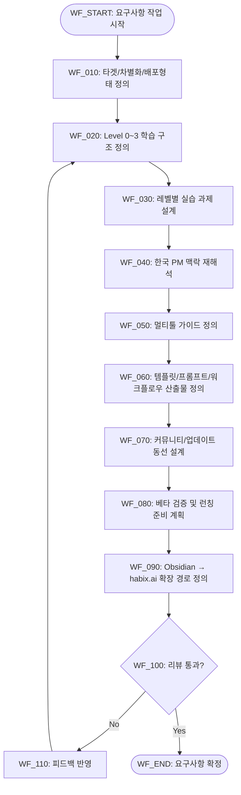

# PRD v2 — ccforpms-한글-가이드북-prd-요구사항

## 0) Document Meta

| 항목 | 내용 |
|---|---|
| 문서 목적 | 한국 PM 대상 AI 활용 가이드북의 요구사항을 확정한다 |
| 대상 독자 | PM, PO, 프로덕트 리더, 콘텐츠 운영자 |
| 기준 문서 | `260217_ai_pm/prd.md` |
| 변경 이력 | v2.1 (`prd.md` FR/NFR/AC와 1:1 정합화) |

---

## 1) Problem & Goal

### 1.1 문제 정의
- 한국 PM이 AI를 실무에 적용할 때, 한국어 기반의 구조화된 실전 가이드가 부족하다.
- 원문 레퍼런스(`ccforpms.com`)는 유용하지만, 한국 실무 맥락으로 재해석된 실행형 구조가 필요하다.

### 1.2 목표 (Goals)
- G-001: `ccforpms.com` 핵심 내용을 한국 PM 관점으로 재구성한 요구사항을 정의한다.
- G-002: Obsidian 기반 초안 → habix.ai 게시 가능한 구조로 확장 가능한 기준을 만든다.
- G-003: 베타 검증(3~5명) 및 런칭 준비까지 연결 가능한 실행 경로를 명시한다.

### 1.3 비목표 (Non-Goals)
- NG-001: 이번 단계에서 habix.ai 최종 프로덕션 개발/배포를 완료하지 않는다.
- NG-002: 모든 산업군별 심화 트랙을 동시 제작하지 않는다.

### 1.4 성공 지표 (Success Metrics)
| Metric ID | 지표 | 기준선(Baseline) | 목표(Target) | 측정 주기 |
|---|---|---:|---:|---|
| M-001 | FR/NFR/AC 정합성 충족률 | 0% | 100% | 문서 작성 시 |
| M-002 | 레벨별 학습목표+실습 정의율 | 0% | 100% | 구조 설계 시 |
| M-003 | 베타 피드백 루프 계획 명시 여부 | 없음 | 포함 | 검증 단계 전 |

---

## 2) Users & Scenarios

### 2.1 핵심 사용자
- P-001: 한국 스타트업/IT 조직의 PM/PO (Primary)
- P-002: PM 취업 준비생, 주니어 PM, AI 도입 준비 중인 프로덕트 리더 (Secondary)

### 2.2 주요 시나리오
- US-001: PM이 Level 0~3 구조를 따라 AI 실무 역량을 단계적으로 습득한다.
- US-002: 작성자가 한국 실무 사례와 멀티툴 가이드를 반영해 콘텐츠를 재구성한다.
- US-003: 운영자가 Obsidian 초안을 habix.ai 게시 구조로 확장한다.

---

## 3) Scope / Constraints / Assumptions

### 3.1 In Scope
- S-001: 한글 가이드북 PRD 요구사항 정의
- S-002: 모듈 구조/실습 구조/차별화 포인트 확정
- S-003: 베타 검증 및 런칭 준비 기준 수립

### 3.2 Out of Scope
- OOS-001: habix.ai 최종 프로덕션 구현/배포
- OOS-002: 산업군별 고급 트랙 동시 제작

### 3.3 제약조건
- C-001: 한국어 중심 문서화
- C-002: 단순 번역이 아닌 한국 PM 실무 맥락 재해석
- C-003: 즉시 실행 가능한 실습/체크리스트 중심 구성

### 3.4 가정(Assumptions)
- A-001: `ccforpms.com` 구조를 레퍼런스로 사용할 수 있다.
- A-002: habix.ai 내 게시 가능한 콘텐츠 슬롯이 존재한다.

---

## 4) Requirements

### 4.1 Functional Requirements (FR)
| ID | 요구사항 | 우선순위 (Must/Should/Could) | 근거(왜 필요한가) |
|---|---|---|---|
| FR-001 | 가이드북은 Level 0~3 학습 구조(입문→기초→실무→고급 자동화)를 포함해야 한다 | Must | 학습 경로 명확화 |
| FR-002 | 각 레벨에는 실제 PM 업무 기반 실습 과제가 포함되어야 한다 | Must | 실무 전환성 확보 |
| FR-003 | 원문 단순 번역이 아니라 한국 PM 실무 맥락으로 재해석되어야 한다 | Must | 현지 적합성 확보 |
| FR-004 | Claude Code 외 ChatGPT/Gemini/Cursor/Notion AI 등 멀티툴 가이드를 포함해야 한다 | Should | 도구 선택 유연성 |
| FR-005 | 템플릿/프롬프트/워크플로우 재사용 산출물을 제공해야 한다 | Should | 실행 비용 절감 |
| FR-006 | 커뮤니티/멤버십 연계 질의응답/업데이트 동선을 설계한다 | Could | 지속 운영성 강화 |

### 4.2 Non-Functional Requirements (NFR)
| ID | 카테고리 | 요구사항 | 목표값/기준 |
|---|---|---|---|
| NFR-001 | Clarity | 비전공 PM도 이해 가능한 한국어 설명/단계 안내 | 리뷰어 1차 이해 가능 |
| NFR-002 | Practicality | 즉시 실행 가능한 체크리스트/실습 중심 구성 | 모듈별 실습 포함 |
| NFR-003 | Consistency | 모듈 간 용어/난이도/산출물 형식 일관성 | 템플릿 기준 통일 |
| NFR-004 | Scalability | Obsidian 구조가 habix.ai 웹 콘텐츠로 확장 가능 | 확장 매핑 정의 |

---

## 5) Mermaid Workflow (시스템 관점)

---

## 6) Mermaid Userflow (유저 관점)

---

## 7) Data / State / Interface

### 7.1 핵심 데이터 모델
| Entity | 필수 필드 | 설명 |
|---|---|---|
| E-REQUIREMENT | id, type(FR/NFR), priority, rationale | 요구사항 원장 |
| E-MODULE | level, objective, practice | 레벨별 학습 설계 |
| E-ASSET | template, prompt, workflow, owner | 재사용 산출물 |
| E-ROADMAP | phase, action, status, owner | 확장 실행 계획 |

### 7.2 상태 전이
| 상태 | 진입 조건 | 이탈 조건 |
|---|---|---|
| ST-NEW | 문서 생성 | 초안 작성 시작 |
| ST-DRAFT | FR/NFR 초안 작성 | 매핑 점검 시작 |
| ST-MAPPED | Traceability 1차 완료 | 리뷰 진행 |
| ST-REVIEWED | 피드백 반영 완료 | 승인 판단 |
| ST-APPROVED | 게이트 충족 | 구현/제작 착수 |

### 7.3 외부 연동 인터페이스
| IF ID | 대상 | 요청 | 응답 | 실패 시 처리 |
|---|---|---|---|---|
| IF-001 | ccforpms.com | 구조/메시지 레퍼런스 확인 | 핵심 목차/패턴 | 수동 요약으로 대체 |
| IF-002 | Obsidian | 초안/템플릿 저장 | 문서 스냅샷 | 버전 마킹 후 재시도 |
| IF-003 | habix.ai | 게시 구조 매핑 | 섹션/포맷 정의 | MVP 포맷으로 축소 |

---

## 8) Error Handling & Recovery

| 실패 상황 | 감지 방식 | 처리 방식 (Retry/Escalate/Skip+Log) | 최대 재시도 | 사용자 노출 메시지 |
|---|---|---|---:|---|
| ERR-001 | 요구사항 모호 | Escalate | 0 | 핵심 맥락 보강 필요 |
| ERR-002 | 범위 과대 | Retry | 2 | MVP 범위로 축소 |
| ERR-003 | 모듈 간 일관성 저하 | Retry | 2 | 용어/형식 기준 재정렬 |
| ERR-004 | 확장 경로 불명확 | Escalate | 0 | habix.ai 포맷 결정 필요 |

---

## 9) Acceptance Criteria (AC)

| AC ID | 설명 | 검증 방법 (Schema/Rule/LLM/Human) | 통과 기준 |
|---|---|---|---|
| AC-001 | Phase 1~4 실행 항목이 요구사항과 일관되게 연결된다 | Rule | 누락 없이 매핑 완료 |
| AC-002 | 타겟 독자/차별화/배포형태가 명확히 문서화된다 | Human | 리뷰 승인 |
| AC-003 | 각 레벨별 학습목표 + 실습 과제가 정의된다 | Rule + Human | Level 0~3 모두 충족 |
| AC-004 | 베타 테스트(3~5명) 피드백 반영 루프가 계획에 포함된다 | Rule | 검증/개선 루프 명시 |

---

## 10) Traceability Matrix (정합성 핵심)

| Req ID | Workflow Node(s) | Userflow Step(s) | AC ID(s) | Test Case ID(s) | 상태 |
|---|---|---|---|---|---|
| FR-001 | WF_020 | UF_030 | AC-003 | TC-001 | ✅ |
| FR-002 | WF_030 | UF_040 | AC-003 | TC-002 | ✅ |
| FR-003 | WF_040 | UF_020 | AC-002 | TC-003 | ✅ |
| FR-004 | WF_050 | UF_050 | AC-001 | TC-004 | ✅ |
| FR-005 | WF_060 | UF_060 | AC-001 | TC-005 | ✅ |
| FR-006 | WF_070 | UF_080 | AC-004 | TC-006 | ✅ |
| NFR-001 | WF_100 | UF_030 | AC-002 | TC-007 | ✅ |
| NFR-002 | WF_030, WF_080 | UF_040 | AC-003 | TC-008 | ✅ |
| NFR-003 | WF_060, WF_100 | UF_060 | AC-001 | TC-009 | ✅ |
| NFR-004 | WF_090 | UF_090 | AC-001 | TC-010 | ✅ |

---

## 11) Test Plan

| TC ID | 목적 | 선행조건 | 절차 | 기대결과 | 연결 Req/AC |
|---|---|---|---|---|---|
| TC-001 | 레벨 구조 검증 | 구조 초안 완료 | Level 0~3 존재/연결 확인 | 누락 없음 | FR-001 / AC-003 |
| TC-002 | 실습 과제 검증 | 레벨 구조 정의 | 레벨별 과제 존재 여부 확인 | 모든 레벨 실습 포함 | FR-002 / AC-003 |
| TC-003 | 한국 맥락 재해석 검증 | 원문 비교 기준 확보 | 사례/업무흐름 반영 점검 | 단순 번역 아님 | FR-003 / AC-002 |
| TC-004 | 멀티툴 커버리지 검증 | 툴 목록 정의 | Claude/ChatGPT/Gemini/Cursor/Notion AI 반영 확인 | 5개 툴 이상 포함 | FR-004 / AC-001 |
| TC-005 | 재사용 산출물 검증 | 템플릿 섹션 작성 | 템플릿/프롬프트/워크플로우 체크 | 3종 산출물 포함 | FR-005 / AC-001 |
| TC-006 | 커뮤니티 동선 검증 | 운영 가정 정리 | Q&A/업데이트 루프 점검 | 동선 명시 | FR-006 / AC-004 |
| TC-007 | 가독성 검증 | 문서 초안 완료 | 리뷰어 1차 읽기 테스트 | 이해 가능 판정 | NFR-001 / AC-002 |
| TC-008 | 실용성 검증 | 체크리스트 초안 | 즉시 실행 항목 비율 점검 | 모듈별 실행 항목 존재 | NFR-002 / AC-003 |
| TC-009 | 일관성 검증 | 전체 문서 완성 | 용어/형식/난이도 규칙 점검 | 규칙 위반 없음 | NFR-003 / AC-001 |
| TC-010 | 확장성 검증 | 확장 경로 정의 | Obsidian→habix 매핑 점검 | 확장 경로 명시 | NFR-004 / AC-001 |

---

## 12) Risks / Trade-offs / Open Questions

### 12.1 리스크
| Risk ID | 내용 | 영향도 | 완화 방안 | Owner |
|---|---|---|---|---|
| R-001 | 범위 확장으로 초기 품질 저하 | High | MVP 범위 고정, 단계별 분할 | PM |
| R-002 | 원문 재해석 품질 편차 | Medium | 리뷰 체크리스트 도입 | PM |

### 12.2 트레이드오프
- T-001: 원문 충실도 vs 한국 실무 적합성 → 실무 적합성 우선, 핵심 원칙 유지

### 12.3 오픈 질문
- Q-001: habix.ai 최종 포맷(문서/코스/툴킷) 우선순위는?
- Q-002: 커뮤니티 운영 범위(무료/유료 멤버십)는?

---

## 13) Implementation Readiness Gate (Go / No-Go)

- [x] FR/NFR 작성 완료
- [x] Mermaid Workflow 렌더링 확인
- [x] Mermaid Userflow 렌더링 확인
- [x] Traceability Matrix 100% 매핑
- [x] AC/TC 연결 완료
- [x] 고위험 경로(Human Review/Escalation) 명시
- [ ] 리뷰어 승인 완료

**결론:** `NO-GO` (리뷰 승인 전)
