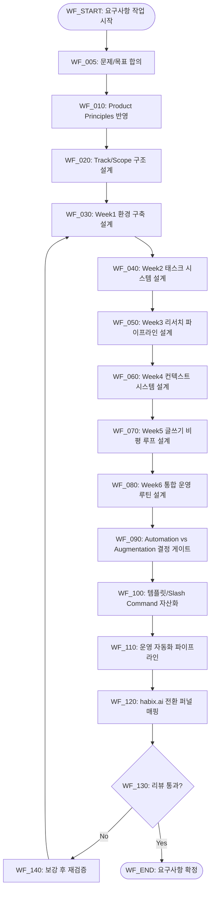

# PRD v2.3 — ccforpms-한글-가이드북-prd-요구사항

## 0) Document Meta

| 항목 | 내용 |
|---|---|
| 문서 목적 | 한국 PM 대상 AI 활용 가이드북을 실행 결과 중심 운영체계 + 6주 실전 프로그램으로 정의한다 |
| 대상 독자 | Junior PM(초기), Senior PM, PM Leader, 콘텐츠 운영자 |
| 기준 문서 | `prd.md`, `docs/prd/PRD-ccforpms-전략정합-개선계획-v1.md`, `docs/prd/PRD-ccforpms-철학원칙-반영-보강계획-v2.md`, `docs/ccforpms-ko-guide/README.md` |
| 참고 프레임워크 | Teresa Torres Claude Code 워크플로우(Automation vs Augmentation, Pair-everything) |
| 변경 이력 | v2.2(철학/원칙 + Junior-first 반영) → v2.3(6주 프로그램 + 실습/운영 루틴 보강) |

---

## 1) Problem & Goal

### 1.1 문제 정의
- 한국 PM이 AI를 실무에 적용할 때, 한국어 기반의 구조화된 실전 가이드가 부족하다.
- 원문 레퍼런스(`ccforpms.com`)는 유용하지만, 한국 실무 맥락으로 재해석된 실행형 학습/운영 구조가 필요하다.
- 비개발/저개발 PM은 도구 설치, 컨텍스트 설계, 자동화 루틴 설계 단계에서 초기에 이탈하기 쉽다.

### 1.2 목표 (Goals)
- G-001: `ccforpms.com` 핵심 내용을 한국 PM 관점으로 재구성한 실행형 요구사항을 정의한다.
- G-002: "읽을거리"가 아니라 실제 산출물(PRD, 분석표, 실행 체크리스트)을 만드는 학습 체계를 구축한다.
- G-003: 초기에는 Junior-first로 시작하되, Senior/Leader 확장 경로를 동일 문서 내에 명시한다.
- G-004: Obsidian 기반 초안 → habix.ai 게시/전환까지 연결 가능한 운영 기준을 확립한다.
- G-005: Teresa Torres 워크플로우를 기반으로 PM 실무에 적용 가능한 6주 프로그램을 제공한다.

### 1.3 비목표 (Non-Goals)
- NG-001: 이번 단계에서 habix.ai 최종 프로덕션 개발/배포를 완료하지 않는다.
- NG-002: 모든 산업군별 심화 트랙을 동시 제작하지 않는다.
- NG-003: 학습자를 소프트웨어 엔지니어로 전환하는 코딩 교육을 목표로 하지 않는다.

### 1.4 성공 지표 (Success Metrics)
| Metric ID | 지표 | 기준선(Baseline) | 목표(Target, R1 가설) | 측정 주기 |
|---|---|---:|---:|---|
| M-001 | FR/NFR/AC/TC 정합성 충족률 | 0% | 100% | 문서 리뷰 시 |
| M-002 | 트랙/모듈 구조 정의 완성률 | 0% | 100% | 구조 설계 시 |
| M-003 | 베타 피드백 루프 명시 여부 | 없음 | 포함 | 검증 단계 전 |
| M-004 | 7일 내 첫 산출물 생성률 (Junior) | 없음 | 50%+ | 주간 |
| M-005 | Core Track(0.x~2.x) 완료율 | 없음 | 40%+ | 주간 |
| M-006 | 템플릿 재사용률 | 없음 | 30%+ | 월간 |
| M-007 | habix.ai 전환율(문서 열람→가입/리드) | 없음 | 5%+ | 월간 |
| M-008 | 30일 재방문율 | 없음 | 25%+ | 월간 |
| M-009 | 자동화 워크플로우 실행률 | 없음 | 70%+ | 월간 |
| M-010 | 6주 프로그램 완주율 | 없음 | 35%+ | 코호트 종료 시 |
| M-011 | `/today` 주간 사용률(활성 학습자 기준) | 없음 | 60%+ | 주간 |
| M-012 | 리서치 다이제스트 자동 생성 성공률 | 없음 | 90%+ | 주간 |
| M-013 | 글쓰기 비평 루프 적용률(초안→리뷰) | 없음 | 50%+ | 주간 |

---

## 2) Product Principles

| Principle ID | 원칙 | 정의 | 검증 포인트 |
|---|---|---|---|
| P1 | 실행 우선 (Execution-first) | 설명보다 결과물 생성에 우선순위를 둔다 | 과제 완료 시 실사용 산출물 생성 |
| P2 | 맥락 우선 (Context-rich) | 품질은 프롬프트 길이가 아니라 맥락 품질로 만든다 | Context 입력 모델/검수 규칙 존재 |
| P3 | PM 오케스트레이션 | PM은 작성자가 아니라 문제 정의·우선순위·검증 루프 설계자다 | Userflow에 의사결정/검증 단계 반영 |
| P4 | 속도-검증 균형 | 빠른 초안 + 빠른 검증(AC/TC/Traceability)으로 운영한다 | AC/TC 매핑 및 리뷰 게이트 존재 |
| P5 | 한국 실무 적합성 | 단순 번역이 아니라 국내 PM 업무 흐름으로 재해석한다 | 한국 맥락 사례/워크플로우 반영 |
| P6 | 자동화 운영 기반 | 반복 작업은 파이프라인화하고 사람은 판단/편집에 집중한다 | 업데이트 자동화/운영 인터페이스 정의 |
| P7 | Automation vs Augmentation | 각 태스크에서 "대신 수행" vs "증강 지원" vs "직접 수행"을 명시적으로 결정한다 | 태스크 템플릿/리뷰에서 의사결정 로그 확인 |

---

## 3) Users & Scenarios

### 3.1 세그먼트 포지셔닝
- SGM-001 (Primary Launch): Junior PM (코딩 경험이 없거나 적은 PM)
- SGM-002 (Secondary Expansion): Senior PM
- SGM-003 (Leadership Extension): PM Leader

### 3.2 세그먼트별 JTBD
- Junior: "무엇부터 해야 할지 모르겠다" → 따라하면 첫 산출물이 나오는 가이드 필요
- Senior: "속도와 품질을 같이 올리고 싶다" → 자동화/병렬 작업/검증 체계 필요
- Leader: "팀 단위 표준화가 필요하다" → 운영 프로토콜/리뷰 체계/지표 대시보드 필요

### 3.3 실패 패턴 및 가드레일
| Segment | 실패 패턴 | 가드레일 |
|---|---|---|
| Junior | 툴 설치/시작에서 이탈 | 진입 체크리스트 + Week1 실습 + 7일 온보딩 루프 |
| Senior | 자동화만 강조하고 품질 검증 누락 | AC/TC/Traceability 검증 게이트 강제 |
| Leader | 팀 확산 전 표준 부재 | 운영 프로토콜/버전 정책/리뷰 규칙 선행 |

---

## 4) Scope / Release / Constraints

### 4.1 In Scope (Track 기준)
- Core Track (Junior-first): 0.0~2.x
- Optional Track:
  - Visual/Product Asset: 3.x (Nano Banana)
  - Build/Ship: 4.x (Vibe Coding)
  - Company Context: C1~C4

### 4.2 In Scope (Program 기준)
- Teresa Torres 워크플로우 기반 6주 실전 프로그램
- 실습 중심 학습 자산(폴더 구조, CLAUDE.md, 태스크 템플릿, Slash Command)
- 일일 루틴(`/today`) + 리서치 파이프라인 + 컨텍스트 라우팅 + 글쓰기 비평 루프

### 4.3 Release Stage
- R1: 문서형 MVP (Core + Week1~Week2)
- R2: 인터랙티브 실습 + 제출형 과제 (Week3~Week5)
- R3: 통합 운영 루틴 + 에이전트 코치 + 운영 자동화 (Week6 + 확장)

### 4.4 Out of Scope (현재)
- OOS-001: habix.ai 최종 프로덕션 구현/배포
- OOS-002: 산업군별 고급 트랙 동시 제작

### 4.5 제약조건
- C-001: 한국어 중심 문서화
- C-002: 단순 번역 금지, 한국 PM 실무 맥락 재해석 필수
- C-003: 즉시 실행 가능한 실습/체크리스트 중심 구성
- C-004: 비개발 PM이 따라갈 수 있는 난이도/도구 의존성 유지

### 4.6 가정(Assumptions)
- A-001: `ccforpms.com` 구조를 레퍼런스로 사용할 수 있다.
- A-002: habix.ai 내 게시 가능한 콘텐츠 슬롯이 존재한다.
- A-003: 베타 테스터(3~5명) 확보가 가능하다.
- A-004: Obsidian + Markdown + Claude Code 환경을 사용할 수 있다.

---

## 5) 6주 실전 프로그램 설계

### 5.1 프로그램 핵심 역량 (Program Capabilities)
1. 개인화된 태스크 관리 시스템 구축
2. 자동화된 리서치 파이프라인 설계
3. 컨텍스트 기반 LLM 활용 체계 수립

### 5.2 핵심 의사결정 프레임워크
모든 태스크에서 다음 3문항을 기록한다.
- Claude가 이걸 대신 해줄 수 있는가? (Automation)
- Claude가 이걸 더 잘 하도록 도울 수 있는가? (Augmentation)
- 내가 직접 하고 싶은 일인가?

### 5.3 Week-by-Week Curriculum
| Week | 주제 | 학습 목표 | 핵심 산출물 |
|---|---|---|---|
| Week 1 | 환경 설정과 기본 개념 | Claude Code/터미널/Obsidian/CLAUDE.md 이해 | 워크스페이스 구조 + 첫 CLAUDE.md + 첫 태스크 |
| Week 2 | 개인화 태스크 관리 | `/today` 구축, 자연어 태스크 생성, 자동 태깅 | `/today` 명령어 + 표준 태스크 템플릿 |
| Week 3 | 리서치 파이프라인 | 다이제스트 자동화, 논문/산업 리포트 요약 체계 | `research/config.yaml` + `paper-summary` 스킬 |
| Week 4 | 컨텍스트 파일 시스템 | Global vs Project CLAUDE.md, 라우팅, 인덱스 설계 | `llm-context/` 구조 + profile/index 라우팅 |
| Week 5 | 글쓰기 워크플로우 | 대필이 아닌 비평 중심 글쓰기 루프 | 스타일 가이드 기반 `/review` 워크플로우 |
| Week 6 | 통합 루틴과 고급 활용 | 일일 루틴 통합, 개선 사이클 정착 | `/today` 기반 운영 루틴 + 회고/개선 프로토콜 |

### 5.4 운영 루틴 (Daily Operating Loop)
- 아침: `/today` 실행 → 오늘/지연 태스크/리서치 다이제스트 확인
- 업무 중: 태스크 파일 내 작업 노트 누적 + 실시간 자연어 태스크 생성
- 종료 시: "오늘 배운 것 문서화" 루프 실행 및 컨텍스트 업데이트

### 5.5 필수 Slash Command 셋
- `/today`, `/newtask`, `/review`, `/competitor`, `/pipeline`, `/digest`, `/weekly`

---

## 6) Requirements

### 6.1 Functional Requirements (FR)
| ID | 요구사항 | 우선순위 (Must/Should/Could) | 근거 |
|---|---|---|---|
| FR-001 | 학습 구조는 Core(0.x~2.x) + Optional(3.x/4.x/Context)로 정의되어야 한다 | Must | Full coverage + 단계적 확장 |
| FR-002 | 각 모듈은 실제 PM 업무 기반 실습 과제를 포함해야 한다 | Must | 실행 전환성 확보 |
| FR-003 | 원문 단순 번역이 아니라 한국 PM 실무 맥락으로 재해석되어야 한다 | Must | 현지 적합성 확보 |
| FR-004 | Claude Code 외 ChatGPT/Gemini/Cursor/Notion AI 등 멀티툴 가이드를 포함해야 한다 | Should | 도구 선택 유연성 |
| FR-005 | 템플릿/프롬프트/워크플로우 재사용 산출물을 제공해야 한다 | Should | 실행 비용 절감 |
| FR-006 | 무료 학습 → 템플릿 다운로드 → habix.ai 전환 동선을 설계해야 한다 | Could | 전환 퍼널 확보 |
| FR-007 | Junior-first 진입 체크리스트와 온보딩 경로를 제공해야 한다 | Must | 초기 이탈 방지 |
| FR-008 | Senior/Leader 확장 모듈 및 업그레이드 경로를 제공해야 한다 | Should | 단계적 확장성 |
| FR-009 | 제출형 과제(문서/분석/실행계획)와 피드백 루프를 제공해야 한다 | Must | 학습-검증 폐루프 구축 |
| FR-010 | 콘텐츠 업데이트 자동화 파이프라인(수집→번역→검수→배포)을 정의해야 한다 | Should | 운영 효율/지속성 |
| FR-011 | `/today` 기반 개인화 일일 브리핑 워크플로우를 제공해야 한다 | Must | 일상 실행 정착 |
| FR-012 | 리서치 다이제스트 파이프라인(아침 수집/저녁 요약)을 제공해야 한다 | Should | 리서치 자동화 |
| FR-013 | Global/Project CLAUDE.md와 컨텍스트 파일 라우팅 규칙을 제공해야 한다 | Must | 맥락 품질/재시작 복원력 |
| FR-014 | 스타일 가이드 기반 글쓰기 비평 워크플로우를 제공해야 한다 | Should | PM 글쓰기 품질 향상 |
| FR-015 | 모든 핵심 태스크에 Automation vs Augmentation 의사결정 단계를 포함해야 한다 | Must | 사람-LLM 역할 분배 명확화 |

### 6.2 Non-Functional Requirements (NFR)
| ID | 카테고리 | 요구사항 | 목표값/기준 |
|---|---|---|---|
| NFR-001 | Clarity | 비전공 PM도 이해 가능한 한국어 설명/단계 안내 | 리뷰어 1차 이해 가능 |
| NFR-002 | Practicality | 즉시 실행 가능한 체크리스트/실습 중심 구성 | 모듈별 실습 포함 |
| NFR-003 | Consistency | 모듈 간 용어/난이도/산출물 형식 일관성 | 템플릿 기준 통일 |
| NFR-004 | Scalability | Obsidian 구조가 habix.ai 웹 콘텐츠로 확장 가능해야 한다 | 확장 매핑 정의 |
| NFR-005 | Freshness | 콘텐츠 최신성 SLA를 운영해야 한다 | 월 1회 이상 업데이트 |
| NFR-006 | Reproducibility | 동일 입력에서 유사 품질 산출이 가능해야 한다 | 표준 템플릿/샘플로 재현 |
| NFR-007 | Transparency | 운영 변경 이력과 버전 추적이 가능해야 한다 | 버전 태깅/롤백 정책 |
| NFR-008 | Accessibility | 코딩 경험이 적은 PM도 6주 커리큘럼을 수행 가능해야 한다 | Week별 진입 체크리스트 충족 |

---

## 7) Mermaid Workflow (시스템 관점)

---

## 8) Mermaid Userflow (유저 관점)

```mermaid
flowchart LR
  UF_000([UF_000: 유저 진입]) --> UF_010[UF_010: 레벨/역할 선택]
  UF_010 --> UF_020[UF_020: Junior-first 시작]

  UF_020 --> UF_030[UF_030: Week1 환경 구축]
  UF_030 --> UF_040[UF_040: Week2 /today + 태스크 운영]
  UF_040 --> UF_050[UF_050: Week3 리서치 다이제스트]
  UF_050 --> UF_060[UF_060: Week4 컨텍스트 파일 라우팅]
  UF_060 --> UF_070[UF_070: Week5 글쓰기 비평 루프]
  UF_070 --> UF_080[UF_080: Week6 통합 운영]

  UF_080 --> UF_090[UF_090: 산출물 제출 + 피드백]
  UF_090 --> UF_100[UF_100: 템플릿 다운로드]
  UF_100 --> UF_110[UF_110: habix.ai 가입/리드 전환]

  UF_080 --> UF_120[UF_120: Senior/Leader 확장 모듈 진입]
  UF_120 --> UF_999([UF_999: 종료])
  UF_110 --> UF_999
```

---

## 9) Data / State / Interface

### 9.1 핵심 데이터 모델
| Entity | 필수 필드 | 설명 |
|---|---|---|
| E-REQUIREMENT | id, type(FR/NFR), priority, rationale, segment | 요구사항 원장 |
| E-MODULE | module_id, level, track, week, target_segment, prerequisites, artifacts, cta | 트랙/주차별 모듈 메타 |
| E-SUBMISSION | submission_id, module_id, artifact_type, reviewer, feedback_status | 제출형 과제 관리 |
| E-ASSET | asset_id, template, prompt, workflow, owner, version | 재사용 자산 |
| E-COMMAND | command_id, purpose, input, output, owner | Slash Command 운영 자산 |
| E-RESEARCH_DIGEST | digest_id, date, source, topic, summary_status | 리서치 다이제스트 |
| E-KPI | metric_id, definition, baseline, target, period, owner | 운영 지표 |
| E-RELEASE | release_id, stage(R1/R2/R3), scope, gate_status | 릴리즈 상태 |

### 9.2 상태 전이
| 상태 | 진입 조건 | 이탈 조건 |
|---|---|---|
| ST-NEW | 문서 생성 | 초안 작성 시작 |
| ST-DRAFT | FR/NFR 초안 작성 | 트랙/주차 흐름 매핑 완료 |
| ST-MAPPED | Traceability 1차 완료 | 검증 리포트 작성 |
| ST-VALIDATED | AC/TC 점검 완료 | 리뷰 승인 판단 |
| ST-APPROVED | 게이트 충족 | 게시/운영 착수 |
| ST-PUBLISHED | habix.ai 배포 | 업데이트 사이클 진입 |

### 9.3 외부 연동 인터페이스
| IF ID | 대상 | 요청 | 응답 | 실패 시 처리 |
|---|---|---|---|---|
| IF-001 | ccforpms.com | 원문 구조/메시지 레퍼런스 수집 | 목차/핵심 원칙 | 수동 큐레이션 전환 |
| IF-002 | Obsidian | 초안/템플릿 저장 및 버전 관리 | 문서 스냅샷 | 버전 고정 후 재시도 |
| IF-003 | 번역/검수 파이프라인 | 번역 품질 점검 | 검수 결과(수정/승인) | Human review로 Escalate |
| IF-004 | 링크 검증기 | 내부/외부 링크 상태 검사 | 유효/오류 목록 | 오류 링크 큐 등록 |
| IF-005 | 배포 스테이징 | 배포 전 미리보기/버전 태깅 | 배포 후보 버전 | 롤백 버전 유지 |
| IF-006 | habix.ai | 콘텐츠 게시/CTA 연결 | 게시 결과/전환 이벤트 | MVP 포맷으로 축소 |
| IF-007 | MCP 서비스 | 외부 워크플로우(태스크/리서치/채널) 연동 | 동기화 결과 | 수동 모드 전환 |

---

## 10) Error Handling & Recovery

| 실패 상황 | 감지 방식 | 처리 방식 (Retry/Escalate/Skip+Log) | 최대 재시도 | 사용자 노출 메시지 |
|---|---|---|---:|---|
| ERR-001 | 요구사항 모호 | Escalate | 0 | 목적/입출력/제약 재정의 필요 |
| ERR-002 | Junior 온보딩 이탈률 과다 | Retry + Guardrail 강화 | 2 | 온보딩 체크리스트 보강 |
| ERR-003 | 과도한 자동화로 품질 저하 | Escalate(Human review) | 1 | 검수 단계 강화 필요 |
| ERR-004 | 트랙/주차 간 일관성 저하 | Retry(템플릿 재정렬) | 2 | 용어/형식 기준 재정렬 |
| ERR-005 | 리서치 다이제스트 실패 누적 | Retry 후 Skip+Log | 2 | 소스/키워드 점검 필요 |
| ERR-006 | 컨텍스트 라우팅 누락 | Escalate | 0 | CLAUDE.md 라우팅 규칙 보강 필요 |
| ERR-007 | habix 전환 경로 미정 | Escalate | 0 | 전환 포맷/CTA 정책 결정 필요 |

---

## 11) Acceptance Criteria (AC)

| AC ID | 설명 | 검증 방법 (Schema/Rule/LLM/Human) | 통과 기준 |
|---|---|---|---|
| AC-001 | Product Principles 7개가 PRD 본문에 명시되고 관련 섹션과 연결된다 | Rule + Human | 원칙별 반영 지점 확인 가능 |
| AC-002 | Junior-first 전략이 Scope/KPI/FR/Workflow/Userflow에 일관 반영된다 | Rule | 관련 섹션 누락 없음 |
| AC-003 | Senior/Leader 확장 경로가 독립적으로 정의된다 | Human | 확장 모듈/시나리오 명시 |
| AC-004 | 실행 산출물(문서/분석/계획) 생성 가능한 제출형 과제가 정의된다 | Rule + Human | 과제+피드백 루프 존재 |
| AC-005 | 맥락 기반 품질 기준이 정의되어 단순 번역을 배제한다 | Rule | Context/검수 규칙 명시 |
| AC-006 | 업데이트 자동화 및 운영 인터페이스가 정의된다 | Rule | IF-003~IF-005 포함 |
| AC-007 | Traceability Matrix가 모든 FR/NFR을 100% 매핑한다 | Rule | 미매핑 0건 |
| AC-008 | Go/No-Go 판단에 필요한 정량/정성 기준이 문서화된다 | Human | 게이트 판단 근거 확인 가능 |
| AC-009 | Week1~Week6 커리큘럼과 산출물이 연결된다 | Rule + Human | 주차별 산출물 누락 없음 |
| AC-010 | 모든 핵심 태스크에 Automation vs Augmentation 판단이 반영된다 | Rule | 의사결정 로그 존재 |

---

## 12) Traceability Matrix (정합성 핵심)

| Req ID | Workflow Node(s) | Userflow Step(s) | AC ID(s) | Test Case ID(s) | 상태 |
|---|---|---|---|---|---|
| FR-001 | WF_020 | UF_010, UF_120 | AC-002, AC-003 | TC-TRK-01 | ✅ |
| FR-002 | WF_040, WF_050, WF_070, WF_080 | UF_040, UF_050, UF_070, UF_080 | AC-004, AC-009 | TC-W2-01, TC-W3-01, TC-W5-01, TC-W6-01 | ✅ |
| FR-003 | WF_010, WF_060 | UF_060 | AC-005 | TC-CTX-01 | ✅ |
| FR-004 | WF_100 | UF_080 | AC-003 | TC-MT-01 | ✅ |
| FR-005 | WF_100 | UF_100 | AC-004 | TC-ASSET-01 | ✅ |
| FR-006 | WF_120 | UF_110 | AC-008 | TC-FNL-01 | ✅ |
| FR-007 | WF_030 | UF_020, UF_030 | AC-002, AC-009 | TC-W1-01 | ✅ |
| FR-008 | WF_020, WF_080 | UF_120 | AC-003 | TC-SR-01, TC-LD-01 | ✅ |
| FR-009 | WF_080, WF_090 | UF_090 | AC-004 | TC-SUB-01 | ✅ |
| FR-010 | WF_110 | UF_080 | AC-006 | TC-OPS-01 | ✅ |
| FR-011 | WF_040, WF_080 | UF_040, UF_080 | AC-009 | TC-W2-02, TC-W6-01 | ✅ |
| FR-012 | WF_050 | UF_050 | AC-009 | TC-W3-02 | ✅ |
| FR-013 | WF_060 | UF_060 | AC-005, AC-009 | TC-W4-01 | ✅ |
| FR-014 | WF_070 | UF_070 | AC-009 | TC-W5-01 | ✅ |
| FR-015 | WF_090 | UF_090 | AC-010 | TC-AA-01 | ✅ |
| NFR-001 | WF_130 | UF_020 | AC-001 | TC-QLT-01 | ✅ |
| NFR-002 | WF_040, WF_050, WF_070 | UF_040, UF_050, UF_070 | AC-004 | TC-W2-01, TC-W3-01, TC-W5-01 | ✅ |
| NFR-003 | WF_100, WF_130 | UF_080 | AC-007 | TC-CONS-01 | ✅ |
| NFR-004 | WF_120 | UF_110 | AC-008 | TC-SCL-01 | ✅ |
| NFR-005 | WF_110 | UF_050, UF_080 | AC-006 | TC-OPS-01 | ✅ |
| NFR-006 | WF_100, WF_130 | UF_090 | AC-005 | TC-REP-01 | ✅ |
| NFR-007 | WF_110, WF_130 | UF_080 | AC-006 | TC-AUD-01 | ✅ |
| NFR-008 | WF_030, WF_040 | UF_030, UF_040 | AC-009 | TC-W1-02 | ✅ |

---

## 13) Test Plan

| TC ID | 목적 | 선행조건 | 절차 | 기대결과 | 연결 Req/AC |
|---|---|---|---|---|---|
| TC-TRK-01 | Core/Optional 트랙 구조 검증 | 트랙 정의 완료 | 0.x~2.x, 3.x, 4.x, Context 존재 여부 확인 | 트랙 누락 없음 | FR-001 / AC-002, AC-003 |
| TC-W1-01 | Week1 환경 구축 검증 | 가이드 초안 완성 | 폴더 구조 + CLAUDE.md + 첫 태스크 생성 | 시작 환경 구축 완료 | FR-007 / AC-009 |
| TC-W1-02 | 비개발 PM 진입성 검증 | Week1 문서 완성 | 설치/시작 단계 사용자 테스트 | 체크리스트 통과 | NFR-008 / AC-009 |
| TC-W2-01 | Week2 태스크 운영 검증 | 태스크 템플릿 정의 | 자연어 태스크 생성 및 태깅 확인 | 템플릿 준수 + 태깅 동작 | FR-002, NFR-002 / AC-004 |
| TC-W2-02 | `/today` 브리핑 검증 | Slash Command 정의 | 오늘/지연/아이디어/다이제스트 포함 여부 점검 | 브리핑 구조 충족 | FR-011 / AC-009 |
| TC-W3-01 | Week3 리서치 실습 검증 | 리서치 설정 완료 | 주제별 수집/요약 실행 | 리서치 산출물 생성 | FR-002 / AC-009 |
| TC-W3-02 | 다이제스트 파이프라인 검증 | 스케줄/소스 정의 | 아침 수집 + 저녁 요약 흐름 점검 | 다이제스트 생성 성공 | FR-012 / AC-009 |
| TC-W4-01 | 컨텍스트 라우팅 검증 | CLAUDE.md 규칙 정의 | 요청 유형별 파일 라우팅 확인 | 필요한 컨텍스트만 로드 | FR-013 / AC-005, AC-009 |
| TC-W5-01 | 글쓰기 비평 워크플로우 검증 | 스타일 가이드 정의 | 초안→리뷰→수정 루프 실행 | 좋은점/개선점 피드백 획득 | FR-014 / AC-009 |
| TC-W6-01 | 통합 운영 루틴 검증 | Week1~5 완료 | `/today` 기반 일일 루틴 실행 | 통합 루틴 정착 가능 | FR-002, FR-011 / AC-009 |
| TC-AA-01 | Automation/Augmentation 게이트 검증 | 태스크 템플릿 정의 | 핵심 태스크 의사결정 로그 점검 | 판단 기록 누락 없음 | FR-015 / AC-010 |
| TC-CTX-01 | 한국 맥락 재해석 검증 | 원문 대비 기준 확보 | 단순 번역 여부/한국 실무 사례 반영 점검 | 재해석 기준 충족 | FR-003 / AC-005 |
| TC-MT-01 | 멀티툴 커버리지 검증 | 툴 목록 정의 | Claude/ChatGPT/Gemini/Cursor/Notion AI 반영 확인 | 멀티툴 가이드 충족 | FR-004 / AC-003 |
| TC-ASSET-01 | 재사용 자산 검증 | 자산 정의 완료 | 템플릿/프롬프트/워크플로우 존재 점검 | 3종 이상 자산 제공 | FR-005 / AC-004 |
| TC-SUB-01 | 제출형 과제+피드백 루프 검증 | 제출 스키마 정의 | 제출→리뷰→수정 루프 실행 | 폐루프 동작 | FR-009 / AC-004 |
| TC-OPS-01 | 운영 자동화 파이프라인 검증 | 운영 인터페이스 정의 | 수집→번역→검수→배포 단계 점검 | 단계별 책임/결과 명확 | FR-010, NFR-005 / AC-006 |
| TC-FNL-01 | habix 전환 퍼널 검증 | CTA 정의 완료 | 열람→다운로드→가입/리드 흐름 점검 | 전환 노드 명확 | FR-006 / AC-008 |
| TC-QLT-01 | 문서 가독성 검증 | 초안 완성 | 리뷰어 1차 읽기 테스트 | 이해 가능 판정 | NFR-001 / AC-001 |
| TC-CONS-01 | 용어/형식 일관성 검증 | 전체 문서 완성 | 템플릿 기준으로 용어/형식 점검 | 규칙 위반 없음 | NFR-003 / AC-007 |
| TC-SCL-01 | 확장성 검증 | habix 매핑 정의 | Obsidian→habix 매핑 점검 | 확장 경로 명시 | NFR-004 / AC-008 |
| TC-REP-01 | 재현성 검증 | 샘플 입력 정의 | 동일 입력 2회 산출 비교 | 유사 품질 유지 | NFR-006 / AC-005 |
| TC-AUD-01 | 운영 투명성 검증 | 버전 정책 정의 | 변경 이력/태깅/롤백 절차 점검 | 추적 가능성 확보 | NFR-007 / AC-006 |

---

## 14) Risks / Trade-offs / Open Questions

### 14.1 리스크
| Risk ID | 내용 | 영향도 | 완화 방안 | Owner |
|---|---|---|---|---|
| R-001 | Junior-first에 치우쳐 확장 설계가 지연될 위험 | High | FR-008/TC-SR-01/TC-LD-01 병행 관리 | PM |
| R-002 | 자동화 우선 운영에서 품질 검수 누락 위험 | High | 샘플링 + Human review 게이트 유지 | PM/운영 |
| R-003 | 번역/학습 자산 일관성 저하로 신뢰도 하락 위험 | Medium | 용어집/템플릿/버전 정책 적용 | 콘텐츠 운영 |
| R-004 | 6주 프로그램 완주율 저하 위험 | Medium | Week별 과제 분량 조절 + 체크인 루프 | 교육 운영 |

### 14.2 트레이드오프
- T-001: 빠른 배포 속도 vs 품질 검증 깊이 → R1은 Core + Week1~2 집중, 검증 게이트 유지
- T-002: 원문 충실도 vs 한국 실무 적합성 → 실무 적합성 우선, 핵심 원칙 보존
- T-003: 자동화 비중 확대 vs PM의 직접 판단 유지 → P7 기반 의사결정 로그 강제

### 14.3 오픈 질문
- Q-001: Junior-first 범위는 0~2 전체 vs 0~1 우선 중 무엇인가?
- Q-002: habix.ai 1차 포맷은 문서형 vs 코스형 중 무엇인가?
- Q-003: BM 시작점은 무료+리드 vs 유료 멤버십 동시 중 무엇인가?
- Q-004: 자동화 운영 수준은 반자동(검수 중심) vs 자동우선(샘플링 검수) 중 무엇인가?
- Q-005: 6주 프로그램의 운영 방식은 코호트형 vs 셀프페이스형 중 무엇인가?

---

## 15) Implementation Readiness Gate (Go / No-Go)

- [x] Product Principles 섹션(P1~P7) 반영
- [x] Junior-first 전략이 Scope/KPI/FR/Workflow/Userflow에 반영
- [x] Senior/Leader 확장 경로 정의
- [x] 6주 커리큘럼(Week1~Week6) 및 산출물 정의
- [x] Automation vs Augmentation 의사결정 프레임 반영
- [x] 운영 자동화 인터페이스 및 파이프라인 정의
- [x] Traceability Matrix 100% 매핑
- [x] AC/TC 연결 완료
- [ ] 리뷰어 승인 완료

**결론:** `NO-GO` (리뷰어 승인 전)
